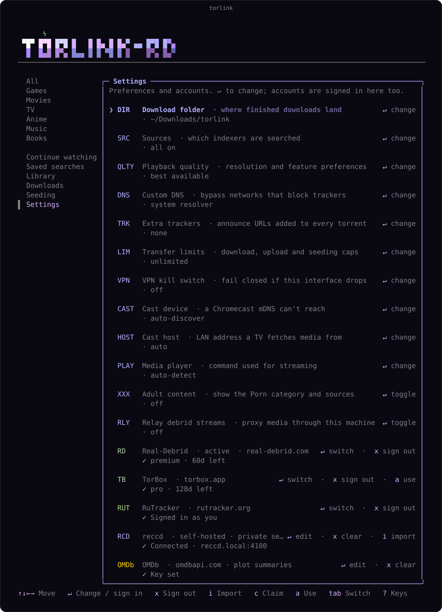

<p align="center">
  
</p>

<p align="center">
  <a href="https://github.com/WarlaxZ/torlink/releases/latest"></a>
  <a href="https://www.npmjs.com/package/torlnk-rd"></a>
  <a href="https://github.com/WarlaxZ/torlink/actions/workflows/ci.yml"></a>
  <a href="https://nodejs.org"></a>
  <a href="LICENSE"></a>
</p>

<p align="center">
  <b>Find something to watch, press play, and it streams.</b><br>
  In your terminal, or in your browser, with nothing to configure.
</p>

Finding a torrent these days sucks. One site is a minefield of fake download buttons. Another hides the
real link under a popup that spawns two more tabs. And after all that, half the results are dead, zero
seeders.

torlink searches a short, hand-picked list of reputable sources all at once and hands you back the
results, sorted, with a **play** button on every one. The files are yours, saved to your downloads
folder.

<p align="center">
  
</p>

Three reasons people stick with it:

- **One keypress to watch.** Press `v` in the terminal or **play** in the browser and it starts
  streaming while it downloads — no waiting for the whole file. Set your quality bar once and
  [one-click play](#one-click-play-and-your-quality-bar) picks the release that fits and starts it.
- **Bring your own debrid, or don't.** With a [Real-Debrid or TorBox](#debrid-real-debrid-or-torbox)
  account, torrents are fetched and streamed from their servers — full speed with no seeders, and your
  IP never touches the swarm. Without one, everything still works peer-to-peer.
- **Same product on every screen.** The [browser interface](#in-your-browser) is not a cut-down port:
  same search, streaming, posters, saved lists and recommendations as the terminal. A seedbox you poke
  from your phone works as well as a laptop.

> A fork of [baairon/torlink](https://github.com/baairon/torlink), adding debrid support, the browser
> interface, one-click play, and quality-of-life touches: remembered preferences, search history, a
> source picker with an auto health-check, and a DNS-over-HTTPS escape hatch for blocked networks.

## What's in here

- **[Get started](#get-started)** — install it and run your first search
- **[What it searches](#what-it-searches)** — the source list, and why it's short
- **[The two front ends](#the-two-front-ends)** — terminal and browser, and what each is good at
- **[Watching something](#watching-something)** — streaming, one-click play, continue watching
- **[Debrid](#debrid-real-debrid-or-torbox)** — Real-Debrid or TorBox, for full speed and a private IP
- **[Downloads and seeding](#downloads-and-seeding)** — the queue, file picking, limits, giving back
- **[Recommendations](#recommendations)** — a For You tab, on by default, or your own reccd
- **[Privacy and staying safe](#privacy-and-staying-safe)** — what's exposed, and the VPN kill switch
- **[Reference](#reference)** — remote access, tokens, DNS, headless modes, containers, the three names
- **[Contributing](#contributing)** — build from source, house style

## Get started

Download a standalone executable from [Releases](https://github.com/WarlaxZ/torlink/releases), or install
the latest macOS/Linux build without Node:

```sh
curl -fsSL https://raw.githubusercontent.com/WarlaxZ/torlink/main/scripts/install.sh | sh
```

Or, with [Node 22+](https://nodejs.org), install it from npm — the command is `torlnk`:

```sh
npm install -g torlnk-rd
torlnk
```

Or run it once, without installing anything:

```sh
npx torlnk-rd
```

**On Windows**, use the executable from [Releases](https://github.com/WarlaxZ/torlink/releases) or the
npm install above — the `curl | sh` one-liner is macOS/Linux only. Everything else works the same; where
this README names a VPN interface or a network caveat, the Windows equivalent is called out.

Globally-installed copies keep themselves current: `torlnk update` pulls the latest release (and
`torlnk` quietly points it out when one is available).

That's the only thing you'll type. torlink opens straight to a search bar: search for what you want,
paste in a magnet link or a bare infohash, or just press Enter on an empty box to browse the curated
library. From there it's all keypresses, nothing to memorize, and `?` brings up the full list anytime.

<p align="center">
  
</p>

## What it searches

A short, hand-picked list of trusted sources:

| Category | Sources |
| --- | --- |
| Games | FitGirl |
| Movies | YTS, The Pirate Bay, 1337x, Torrents.csv, BitTorrented |
| TV | EZTV, The Pirate Bay, 1337x, BitTorrented |
| Anime | Nyaa, SubsPlease |
| Books | The Pirate Bay, Nyaa |
| Music | The Pirate Bay, 1337x |

**RuTracker** is available across Games, Movies, TV, Anime, Music, and Books and requires a free account.
Sign in from the **Settings** tab in the sidebar; credentials go only to rutracker.org and only the
session cookie is stored locally. If asked for a captcha, follow the link and copy the code back.

Games are the only category that intentionally distributes executable software, so they come from
FitGirl alone, a repacker with a long, trusted track record; the other categories are media or document
files. If a source is down, the search carries on without it, and torlink tells you which one is
offline. A source that keeps failing is set aside automatically for a while so it stops slowing searches
down; you can also switch sources on and off yourself with `Shift+S`.

<p align="center">
  
</p>

### Adult content (optional, off by default)

torlink ships with an optional **Porn** category that is **off by default** — its tab, sources, and
results stay completely hidden until you turn it on. Press **`Shift+X`** to toggle it; when enabled you
get a **Porn** tab (backed by The Pirate Bay and 1337x) and adult results also appear under **All**.

Prefer to control it without touching the app? Set `TORLINK_ADULT=1` before launching to force it on, or
`TORLINK_ADULT=0` to force it off (the env var takes precedence over the in-app setting). It can also be
persisted by setting `"adultContent": true` in your config file.

## The two front ends

Both read and write the same config, so a list you save in one shows up in the other. Use whichever
suits where you are.

### In your browser

Add `--web` and torlink also serves a browser interface — search every source (or submit an empty box to
browse the curated library, same as the TUI), posters and plots, play something, the queue, your saved
searches, library and continue watching, and your For You feed — over the same queue as the process
hosting it. Handy for a seedbox you check from your phone, or just for using torlink without a terminal
open.

```sh
torlnk --web          # the TUI hosts it; quitting the TUI stops it
torlnk serve --web    # no TUI: the add API plus the browser UI
```

The layout collapses to one column on a narrow screen, so the phone you already have in your hand is a
usable remote for a machine in the cupboard:

<p align="center">
  
</p>

Results stream in as each source answers — you'll see `12/23 sources` climb rather than staring at a
spinner. Category tabs, sort orders and the alive-only filter are the same code the terminal uses, so the
two never disagree about what a result is or how the list is ordered.

**Many uploads of one film collapse to one row.** A browse of a single category routinely returns four
copies of everything — one live search for a popular film came back with 129 results that were 21 actual
things — so releases are grouped under their title, with a count you can expand to see every copy. Turn
it off with the **group** control. Each row also carries short quality badges (`2160p`, `HDR`, `Remux`)
read out of the release name, so you don't have to parse a 70-character filename to see what it is.
Grouping and the badges are in **both** front ends: in the terminal, **`g`** turns grouping on or off and
**space** expands the group under the cursor. The grouping key knows that an episode, a season pack and a
film are different things, so `Kepler S02E04` never merges with `Kepler S02E05` or with a `Harrowgate S03`
pack — and each heading **says which one it is** (`Harrowgate S03`, `Kepler S02E04`, `Tin Rivers (2024)`),
because a whole season's worth of headings all reading just the show's name looks like the list failed to
group at all.

**A show nests the way a show does.** One row per season, newest first, holding the season packs and then
each episode in order — so a search for a show is a handful of rows rather than forty siblings in seeder
order. The season you are most likely to want opens itself; the rest stay shut until you ask. A collapsed
season that has a **season pack** plays the pack, so `play` on `Harrowgate S03` gets the season and not
episode one — and the pack's file picker opens on the episode you are up to. A season that is only loose
episodes has no such single torrent, so `play` there **reveals the episodes and selects the one you are up
to** (the next one if you are part-way through, else the first) rather than silently playing episode one —
you choose which to watch. Inside a season the show's name is stated once, by the season row, and its children read
`Season pack`, `S03E01`, `S03E02`. The **group** control still turns all of it off and gives you every
release as its own row.

**It remembers where you are.** Play an episode and the next time that show comes up, the
season that opens is the one you are part-way through — not the newest — its heading says
how far you got, and the episode you have not seen yet is the one already selected. The
position moves only when a player actually starts, so a cancelled stream never counts, and
it is read from the file you really opened, so watching one episode out of a season pack
still advances it. Nothing is marked "watched": torlink keeps the furthest point you
reached, which is an honest thing to say, rather than guessing at every episode below it.

Selecting a result shows its poster, plot and IMDb link, if you've added a free
[OMDb](https://www.omdbapi.com/apikey.aspx) key under **Settings** in the TUI — the same key that powers
the terminal's preview pane. Without one everything still works; you just get the release names. The
**Anime** tab is the exception: it fetches posters and plots from
[AniList](https://anilist.co/), a free anime database that needs no key, so anime has artwork even
before you set one up.

That pane stays where you can see it: on a wide screen it pins below the toolbar and scrolls its own plot,
and on a phone it becomes a bar across the bottom of the window rather than something 25,000 pixels below
the list. The header, the category tabs and the sort controls are pinned too, so you can change tab or
re-sort without scrolling back to the top of a long browse. Press **`/`** to jump to the search box from
anywhere, and drive the list with the arrow keys.

From a result you can **add** it to the queue, **play** it straight away, **copy magnet**, or
**export .torrent** — the same
metadata-only export as the terminal's `e`, writing the file into the download folder on the machine
torlink is running on, and telling you which folder that was. Under TorBox, a result already on their servers
also carries a **cached** marker — Real-Debrid results never show one, for the same reason the terminal
doesn't (see [Debrid](#debrid-real-debrid-or-torbox)). Where a debrid provider is configured the plain
**add** is replaced by **add via RD** / **add via TorBox**: the browser routes every add through the
provider and never downloads direct peer-to-peer (the terminal keeps its plain `d`, which warns first).

`torlnk serve --web` lands on serve's own port, **`http://127.0.0.1:9161`**, and **opens your browser
there for you**. `torlnk --web` lands on **`http://127.0.0.1:9162`** and prints the address on the
splash — it doesn't steal focus, because you asked for a terminal UI; press **shift+w** (anywhere but
the splash's search box) to open it. Change either port with `--port`. Under `serve` there's one server,
not two: the same port answers the dashboard *and* `/add`, `/downloads` and `/control`, so there's one
address to remember and one thing to firewall.

Pass `--headless` to `serve --web` if you'd rather it just printed the link. It also opens nothing under
`--daemon`, or when stdout isn't a terminal — a browser window on a machine nobody is sitting at is not
a feature.

**Turning it off is just leaving `--web` off** — there's no setting to forget about, and nothing listens
until you ask for it. If the port is already taken, the TUI says so and carries on without the dashboard
(the terminal is the product; a missing web UI shouldn't kill your session), while `serve --web` treats
it as a startup failure and exits, because a daemon that came up half-configured is worse than one that
didn't come up.

To reach it from another device, see [Remote access and tokens](#remote-access-and-tokens) — binding
anything other than loopback requires a token.

#### What the browser can't do yet

- **No restarting a stopped seed.** Stopping one drops it out of the status payload into history, which
  the browser can't see. (A failed *download* is a different thing and does have a **Retry** button.)
- **No "open folder".** TUI-only, because it means opening a file manager on the machine torlink is
  running on, which a phone on your sofa is not. (Exporting a `.torrent` *is* here — see below.)
- **Two keyboard shortcuts, not the terminal's hundred-odd.** `/` focuses the search box from anywhere
  and the arrow keys walk the results. There is no `?` overlay — the browser is buttons, and the
  shortcuts worth having on a surface you mostly touch are few.
- **No scrubber.** [Continue watching](#continue-watching) does play the next episode
  automatically when a row names one — it just can't resume *where* you left off, because nothing here
  reads back from mpv, iina, vlc, or a browser tab; none of them report a position.
- **Subtitles, partly.** A `.srt` or `.vtt` shipped alongside the video is matched to it and shown in
  the browser's own subtitle menu, and offered next to "Download .m3u" as a "Download subtitle" link
  for anyone who'd rather open it themselves. When torlink itself launches the player, mpv and iina
  take that same file side-loaded automatically; VLC doesn't — there's no VLC 3 command-line flag that
  side-loads a subtitle from a URL (the obvious ones either misfile it as an audio track or resolve it
  as a local path), so a VLC user gets the download link instead of a broken automatic attempt. ASS and
  SSA are matched too, but the browser doesn't offer them anywhere — no track, no download link —
  because there's no way to show one without re-encoding it, and torlink doesn't run ffmpeg. Tracks
  muxed *inside* the file are named on the fallback card so you know they're there — pulling one out
  has the same ffmpeg problem.
- **No account or secret entry — but there is a settings page now.** The gear in the header opens a
  **Settings** dialog that changes the non-secret preferences directly, over the same Origin-checked API
  as everything else here: adult content, transfer and seeding limits, which sources are on, playback
  quality, the download folder, the media player, and whether debrid streams relay through this machine.
  What it deliberately still can't touch is credentials and host-specific network config — every token
  (Real-Debrid, TorBox, OMDb, and reccd's own URL and bearer token), custom DNS, extra trackers, the VPN
  kill switch, and the [cast device and advertised-host addresses](#casting-to-a-tv). Those stay TUI-only;
  the Settings dialog shows account status read-only and points you to the terminal, and the browser only
  ever learns *whether* reccd is configured (which is what turns on title autocomplete and the **For You**
  tab), never its address or token. Claiming your [reccd](#recommendations) account is credential entry
  too, so it stays there as well. Alongside the settings it writes, the browser writes your saved
  searches, your library and your continue-watching list — the same searches, favourites and stream
  history the TUI's `w`, `b`, and Continue-watching pane create.

### In your terminal

Type what you're looking for and press Enter. Results stream in from every source as they answer, tagged
with size and how many people are sharing each one, so you can see what'll come down fast. Arrow to what
you want and press `d` to save it, or `shift+d` to pick a different folder for just that download.

Press `s` to re-sort by seeders, size, or source, and `↑` in the search box to bring back a recent
search. torlink remembers your sort and the tab you were on between runs, so it opens right where you
left off.

Many uploads of the same film collapse to one row, showing its title, year and how many copies there are —
press **space** to open one up, or **`g`** to switch grouping off entirely. Acting on a collapsed row acts
on its best copy, so `v` streams the pick you'd have chosen anyway. Rows carry short quality badges
(`2160p`, `HDR`, `Remux`) as far as the terminal's width allows, resolution first.

On a wide enough terminal a preview pane opens beside the results: highlight a film or show and torlink
fetches its poster and plot and renders them right in the terminal (bring your own free
[OMDb](https://www.omdbapi.com/apikey.aspx) key, added under Settings). Anime is the exception —
its posters and plots come from [AniList](https://anilist.co/), a free anime database that needs no
key. Press `p` to toggle the pane, or `i` on any result to open its IMDb page. Adult results, which OMDb
doesn't cover, instead show the full release name and a parsed breakdown (studio, year, resolution,
source) — no key or lookup needed, and the same in the browser. When a torrent's description carries
screenshots, those show too — a strip of thumbnails you can click to enlarge in the browser, one image
in the terminal — fetched only when you highlight the result and proxied through torlink so your browser
never touches the image host directly. It falls back to the breakdown when a description has none. Turn
it off with the **Adult screenshots** setting (on by default).

Press `w` on any named search to add or remove it from your Saved searches. The pane keeps up to 50;
press `Enter` to run one again or `x` to remove it.

Press `Enter` on a result to open its details, and `e` there to save it as a `.torrent` file in your
download folder — handy for handing a release to another client. Nothing is downloaded: torlink fetches
just the metadata and drops the connection the moment it arrives.

<p align="center">
  
</p>

## Watching something

### Press play

Don't want to wait for a download? Press **`v`** in the terminal on a movie or an episode, or hit
**play** on any row in the browser, and torlink opens the video while it downloads.

In the terminal, the first time it'll ask which player to use (`mpv`, `iina`, `vlc`, or a path); after
that it just plays. You can set one ahead of time with `TORLINK_PLAYER`. While it plays, a banner shows
the active stream; press **`x`** to stop.

In the browser, torlnk resolves the torrent — through the active debrid provider if you have one
connected, otherwise straight from the swarm — picks the video file (or asks, if there are several), and
opens a player page. While it resolves, the button you pressed says so and a line in the corner of the
window counts up — `Caching on Real-Debrid… 42% · 12s`, the same words the terminal uses — because a
torrent your provider has never seen genuinely takes minutes. That line carries a **Cancel** that stops
the session, the browser's answer to the terminal's `esc`. When there are several files to choose from,
the question opens over the page rather than at the top of it, so it finds you wherever you had scrolled. Before it builds a player at all it asks the server what the file actually *is* —
container and codecs, read with `ffprobe` where you have it and from the release name where you don't. So
what happens next is decided up front, and you find out immediately rather than watching a black rectangle
give up after twelve seconds:

- **mp4/H.264** plays inline. The video element streams it directly, and seeking works properly because
  the server honours range requests.
- **mkv, HEVC, DTS** — most of the scene — will not decode in Chrome or Firefox; no browser ships those
  codecs. Where your **debrid provider will transcode it for you**, the player uses their stream, with full
  seeking, and without a byte passing through the machine running torlnk.
  Real-Debrid does this. TorBox publishes no equivalent, so a TorBox stream falls through to the next line.
  **A provider offering a transcode is not the same as one that can keep up with it**, though: their
  transcoder works on demand, from the start of the file, and for a big HEVC release it can fall behind
  real time — at which point it serves the part of a segment it has finished as though it were the whole
  thing, and the browser has no way to tell. That used to show up as a video that played for a few seconds
  and then froze with nothing on screen to explain it. So the player now checks a segment before offering
  the transcode at all, and a provider that is not keeping up falls through to the next line instead. If
  one stalls anyway — the check can be fooled by a file whose opening the provider has already transcoded —
  playback says so and points you at the `.m3u`, rather than freezing in silence.
  Turning on [relaying](#relaying-streams-through-this-machine) switches this off on purpose: their stream
  is played from *their* servers by your browser, which is the one thing relaying exists to prevent — so
  while it's on, these releases fall through to the next line too.
- **Anything left over** — a release streamed from the swarm, or one the provider won't transcode — gets a
  card naming the part your browser can't handle, plus a **Download .m3u** button: your OS hands that tiny
  playlist to VLC (or whatever your default player is) and it plays there. That card also offers to
  [cast it](#casting-to-a-tv) when the file is one a Chromecast can play but your browser can't — an MP4
  carrying AC3 is the common case. On iOS and Android there's also
  a direct **Open in VLC** button, because those apps register a URL scheme a web page can link to.
  Desktop VLC registers none — not on macOS, Windows or Linux — so there's no button to offer there, and
  the `.m3u` is the route that works. It also doesn't assume VLC is what you watch things in.

#### Casting to a TV

Both front ends can put a stream on a Chromecast. In the browser it's a **Cast to TV** button next to the
other hand-off buttons; in the terminal it's `c` in the stream file picker, which lists what it found and
casts to the one you pick. Once it's playing you get pause, resume, stop and a position — the seek bar and
the volume stay with the TV's own remote, which is already in the room.

torlnk drives the device itself rather than going through Google's web SDK, and that's the reason it works
at all: the SDK only runs on a secure origin, and the normal way to reach this dashboard is
`http://192.168.x.x`. A cast button built on it would work from `localhost` and nowhere else, which is the
same dead-button problem desktop VLC has.

What it will and won't play, stated plainly, because a Chromecast is fussier than a browser in one
direction and less fussy in another:

- **MP4 and WebM carrying H.264 cast directly.** Nothing is transcoded and nothing passes through this
  machine twice.
- **AC3 and E-AC3 are passed through to the television.** Your browser refuses those, so this is one case
  where the TV can play something the dashboard can't — the fallback card offers to cast it. The catch: it's
  passthrough, so on a TV or receiver that can't decode it you get picture and no sound. Stop the cast and
  play it locally.
- **An MKV casts only on the debrid backend**, via the provider's transcode — the same rung the browser
  player uses. Straight from the swarm there's nothing to transcode it with, so the button says so instead
  of failing at the television.
- **HEVC casts on neither backend.** That needs a full re-encode, which needs per-platform hardware
  acceleration; it's a deliberate gap rather than an oversight, and the `.m3u` hand-off is still there.
- **The subtitle you'd have seen in the browser goes with it**, as a sidecar track.

Discovery uses mDNS, which does not cross a Docker bridge or a VLAN — so if you run torlnk in a container
and the list comes back empty, that's why. The device list lets you type an address (`192.168.0.40`, or
`host:port`) and remembers it, so a device mDNS can't reach still casts.

##### Casting from WSL, or from a bridged container

If torlnk runs somewhere the television can't reach it *back*, casting needs one more thing. WSL2 in its
default mode is the case that bites: inside the VM, torlnk's own address is a `172.x` one that nothing on
your LAN can route to, so it hands the TV a URL that goes nowhere and the TV reports it as a file it
couldn't play — which blames the file for a network problem.

The clean fix, if your Windows is new enough (Windows 11 22H2+, `wsl --version` reporting WSL 2.0 or
later), is to put this in `%UserProfile%\.wslconfig` and run `wsl --shutdown`:

```ini
[wsl2]
networkingMode=mirrored
```

That makes WSL share the Windows host's network instead of hiding behind it, which fixes discovery *and*
reachability — mDNS starts working too, which nothing below can do for you.

Where mirrored mode isn't available, forward the port on the Windows side and then tell torlnk what
address to advertise, because it has no way to work that out from inside the VM:

```powershell
netsh interface portproxy add v4tov4 listenport=9162 listenaddress=0.0.0.0 `
  connectport=9162 connectaddress=<the WSL eth0 address>
New-NetFirewallRule -DisplayName "torlnk" -Direction Inbound -LocalPort 9162 -Protocol TCP -Action Allow
```

Then tell torlnk what to advertise. Both cast settings take an environment variable, because the setups
that need them are deployed into rather than configured on — a `.bashrc` or a compose file's
`environment:` is where they naturally live, and neither has a TUI to open:

```bash
TORLINK_CAST_HOST=192.168.0.10        # your Windows machine's LAN address, or host:port
TORLINK_CAST_DEVICE=192.168.0.40      # the TV, since mDNS won't cross the NAT either
```

Both are also plain config fields (`castAdvertiseHost` and `castDevice`), and the device one is what the
terminal's device list writes when you type an address into it. The same applies to Docker without
`--network host`.

Two limits worth knowing. Casting needs the television to fetch the file *from this machine*, so a cast
started in the terminal brings the browser UI up on your LAN address with a token if it isn't already
running — it tells you when it does, because that's a real change to what the machine is serving. And a
cast is per-process: one started in the terminal isn't visible to a separate `torlnk serve --web`, and the
other way round. Where the TUI is hosting the browser UI itself (`shift+w`), it's one process and both
surfaces see the one cast.

#### The player page knows what else is in the torrent

Play an episode out of a season pack and the page you land on lists the rest of it: **up next** first, then
every episode in the torrent, headed by season when there is more than one. Each is a link to the same
page for that file, so the next episode is one click — you never go back to the search, and you never
reopen the picker. This is the browser catching up to the terminal, whose picker has always stayed open
after launching a player so the next episode is one keypress away.

There is also **Download rest of season .m3u**, which is one playlist containing this episode and every
later one *of the same season* — hand it to VLC once and it runs the rest of the season unattended.
Bonus features and extras are left out, so a gag reel can't interrupt episode four, and every entry is
titled, so a thirteen-episode playlist reads as episodes rather than as thirteen identical URLs. Open a
bonus feature instead and the button says **Download the rest as .m3u**, because there's no season there
to be the rest of.

Above the filename is a breadcrumb back to the show, and the header's **back to results** goes back to the
search you ran rather than to an empty box: the dashboard now keeps its query and category in its own URL,
so a full page load — which is what the browser's Back button does here, because the player is a separate
page — restores what you were looking at. That also means a search is a link you can bookmark or send to
another device. Only the query and the tab; a stream is per-session and dies with it, so nothing in that
URL claims to resume one.

That check is also why the card is honest about *which* part is the problem. An `.mp4` that turns out to be
carrying HEVC used to look playable right up until it wasn't; now it's caught before anything loads.

<p align="center">
  
</p>

**torlnk still does no transcoding of its own.** It will not burn your CPU re-encoding a 4K remux so a
browser can play it — the transcode in that second case is the *provider's*, on their hardware and their
bandwidth, which is why it costs you nothing. Where that isn't on offer, the `.m3u` route is lossless and
works on every platform.

**Without a debrid provider**, streaming runs **peer-to-peer** through a local server — the pieces you're
watching download to a temporary folder as they play. Because that connects you straight to the swarm,
torlink warns you once that your IP is visible to peers before the first torrent stream. If the file
finished downloading by the time you stop, torlink offers to **keep** it — moving it into your downloads
folder to seed — otherwise the temporary copy is cleaned up. In the browser, the bytes are proxied from
the local torrent client, which is what makes a phone on your LAN able to play a swarm it can't reach
itself.

**With a debrid account connected**, `v` and **play** stream from that provider's servers instead:
faster, no waiting on seeders, and your IP never touches the swarm. torlink takes that route
automatically whenever an account is active. In the terminal it falls back to a torrent stream only if you
confirm it, so a debrid provider never quietly drops you onto peer-to-peer. The browser (`serve --web`) is
stricter still: it is typically a headless or remote box whose IP must never touch the swarm, so when a
provider is configured it *always* uses it and never streams — or downloads — direct peer-to-peer, even if
the account looks lapsed (it attempts the provider and reports what the provider says). By default the browser's player
redirects straight to their CDN, so the video never passes through the machine running torlnk — you get
their bandwidth and native seeking. If you'd rather the link to your account never left the server, you
can [relay it through this machine](#relaying-streams-through-this-machine) instead.

### One-click play and your quality bar

For You and [Continue watching](#continue-watching) don't always make you pick a release yourself —
pressing `↵` on a pick can search every source and play the winner outright.

What "winner" means is a preference you set once: press **`P`** in the terminal, or open **playback
preferences** in the browser's header, for a **max resolution** ceiling (absent means no ceiling) and a
require/exclude toggle over a fixed list of features — HDR, Dolby Vision, Atmos, Dolby Digital, DTS,
TrueHD, Remux, HEVC/x265, and 10-bit. The same preference and the same fixed list back both front ends,
so a cap you set in one is the cap the other honours.

<p align="center">
  
</p>

Ranking is resolution first, then, for a show, a release that names the episode you're actually watching
over a season pack, then the largest file, then the most seeders. With nothing set, that means **the best
resolution available wins, not the biggest file.**

Both the ceiling and the required features are **soft** — a preference torlink relaxes rather than a wall
it refuses to cross. If nothing fits under your resolution cap, the cap is dropped and the closest
release above it plays. If nothing matches every required feature, the rarest one is dropped first (and
the next-rarest, and so on) until something does. Either way, the status line says what gave way —
"nothing at 720p or below" or "no Atmos release" — so it never looks like the preference was silently
ignored. **Excluded features are the one hard rule**: if everything found carries something you
excluded, nothing plays.

That ranking is what one-click play uses. On a For You pick it plays a confirmed film — OMDb says it's a
movie, or the pane's type filter is explicitly films — and searches instead for anything less certain,
landing you in the search pane rather than guessing. On a Continue watching row it plays the next episode
when the row can name one, and otherwise resumes the stored torrent exactly as before, unchanged.

`s` in the terminal always searches instead of playing, for either pane. The browser's For You cards
carry the same always-**search** button alongside a **Play** button that only appears for a confirmed
film.

> **Worth knowing:** because resolution outranks the episode-versus-pack preference, watching one episode
> can fetch an entire season — a 2160p season pack beats a 720p release of just the episode you asked
> for. That's deliberate, not a bug, and `maxResolution` is the lever: cap it below the pack's resolution
> — as long as something still survives under that cap, such as the single episode itself — and the
> single episode wins instead. (A cap that excludes everything is a no-op, per the soft-ceiling behaviour
> above.)

### Continue watching

Titles you're part-way through, newest first, up to 200. Both front ends read the same list — streaming
from either one writes the same file. Each row shows the title and, when it can tell one honestly, a
suggested next episode; a season pack with no episode number in its name gets no guess, and neither does
a film.

**In the terminal**, it's a section in the sidebar:

- `Enter` plays the next episode when the row names one — a fresh search, ranked against your quality bar
  above — and otherwise replays the same torrent that worked last time. Either way it does nothing while
  another stream is still running; stop that one first.
- `x` forgets the row — except while a stream is running, when `x` stops that stream instead, so a stray
  keypress can't kill your playback and delete a row at once. The footer says which one `x` will do.

**In the browser**, it's a strip above the saved pane's two columns, with a fuller subtitle than a
terminal row has space for: how long ago you streamed it and the last episode you watched.

- **play** always replays the remembered torrent.
- **Play next**, when a next episode is known, runs a fresh search ranked against your quality bar and
  falls back to that same replay if nothing turns up.
- **search** shows you the other releases instead of resuming or auto-playing — the same escape hatch the
  For You rows have.
- **✕** removes the row.

**When a torrent holds several files**, the file picker opens on the suggested next episode rather than
the first file — which for a season pack is usually the one you just watched. That applies to any release
of a show you're part-way through, whether you played it from here, from a search, or from your library.
The list itself is in title order, so a season pack reads E01, E02, E03 whatever order the torrent happens
to name its files in — press **s** in the terminal, or the **sort** button in the browser, to switch to
largest-first instead.

**There's no resume position.** torlink can't see into mpv, iina, vlc, or a browser tab, so this remembers
*what* you were watching, not *where* you got to.

## Debrid: Real-Debrid or TorBox

torlink works great on its own, but if you have a [Real-Debrid](https://real-debrid.com) or
[TorBox](https://torbox.app) account you can plug it in for a noticeably better ride. Either service
pulls the torrent onto its own servers and hands you back a plain, direct download. That means full speed
even on a torrent with no seeders, nothing waiting on a swarm to wake up, and — because the provider does
the torrenting, not you — your IP never touches the network.

To connect one, open the **Settings** tab in the sidebar (alongside Downloads and Seeding), scroll to
the accounts at the bottom, select Real-Debrid or TorBox, and paste in the API token — from
[real-debrid.com/apitoken](https://real-debrid.com/apitoken) or
[torbox.app/settings](https://torbox.app/settings) respectively. torlink checks it and remembers it.
(Prefer to keep a token off disk? Set `REALDEBRID_API_TOKEN` or `TORBOX_API_TOKEN` in your environment
instead and torlink picks it up — either one overrides whatever's saved in config for that provider.)

If you connect both, torlink needs to know which one actually resolves your magnets: press **`a`** on the
highlighted provider in the Settings tab to make it the active one. With only one token configured, that
one is used automatically; with both and no explicit choice made yet, torlink prefers Real-Debrid, so
upgrading from an earlier version that only knew about Real-Debrid doesn't change how it behaves.

<p align="center">
  
</p>

Once one's connected, downloading and streaming get an upgrade:

- **`r` — download via the active debrid provider.** torlink hands the magnet over, waits for it to be
  ready, and downloads the direct link straight to your folder. If it's already cached on the provider's
  end it's basically instant. The plain `d` download still works exactly as before, but now it warns you
  first, since that route is peer-to-peer and exposes your IP.
- **`v` — stream via the active debrid provider.** [Streaming](#press-play) routes through their servers
  instead of the swarm. If the provider can't prepare it (or your premium's lapsed), torlink tells you
  and offers a torrent stream instead rather than switching to peer-to-peer on its own.

Debrid torrents are fetched, not seeded, so they land in Recently downloaded and never join the Seeding
tab. Heads up: Real-Debrid's torrent features need an active **premium** account — torlink will tell you
if yours isn't. TorBox's free tier can add torrents too; a paid plan only raises its size limit.

TorBox results also carry a **`cached`** marker on anything it already has ready to go — a hint that the
download or stream will be instant. Real-Debrid results never show that marker, not because nothing there
is cached, but because Real-Debrid withdrew its instant-availability check in 2024 and torlink won't
guess: an absent marker means "can't tell," never "not cached."

### Relaying streams through this machine

By default the browser's player is sent straight to your provider's CDN, which is the fast, free thing to
do — but that redirect hands the player the **unrestricted link**, and that link is a bearer URL good
against your whole account, not just the one stream. Anyone who ends up with it can pull from your quota
until it expires, no token needed.

Press **`N`** in the terminal and torlink relays instead: it fetches from the provider and forwards the
bytes on, so the credential-shaped URL stops at the server and never reaches a player, a browser history,
or a chat message someone pasted a link into. **This is worth having with one user and no sharing at
all** — it's the same file, minus a credential handed out. A side effect, if you do share: every viewer
reaches the provider from this one machine rather than from their own address.

It costs something, and it lands where you might not expect — **upload**. Every byte still comes down from
the provider, but now it has to go back up from here to whoever's watching: roughly **25 Mbps up for a
1080p remux**, nearer **80 for 4K**. Three remote viewers of that 1080p remux want about **75 Mbps up**,
which is more than most domestic lines have spare. A viewer on your own LAN costs no upload at all — those
bytes never leave the network. Nothing is re-encoded, so your CPU barely notices.

It costs one convenience too: an mkv your provider would have transcoded for the browser now gets the
`.m3u` card instead, because that transcode is played from their servers and relaying is the decision not
to do that. The file still plays — in VLC, losslessly — it just isn't in the tab any more.

The browser has no switch for this, on purpose: it's a client of your config, not an editor of it, so it
picks up the change on its own like everything else here. And one thing stated plainly, with no argument
either way — sharing a debrid account is against Real-Debrid's terms, and they enforce on concurrency and
device count, not only on how many addresses a token is seen from.

## Downloads and seeding

Active downloads sit up top with their progress, speed, and time left; when one finishes it drops into
Recently downloaded just below, so the list stays tidy. Everything's still there when you come back, and
anything interrupted picks up where it left off.

Downloads run in the background while you keep searching, so you can queue up as many as you want. They
save to your downloads folder, and the Downloads pane keeps tabs on each one; press `o` anytime to change
where that is, or grab one result with `shift+d` to send it somewhere else without touching the default.
When something finishes it keeps seeding automatically so the next person can find it too, and the
Seeding tab lets you pause or stop that anytime.

When a torrent contains several files, torlink pauses before transferring payload data and lets you
choose exactly which files to download. Use `Space` to toggle files, `a` to select all, and `Enter` to
begin.

Press `Shift+L` to set download/upload limits and automatic seeding targets. Values are entered as
`download KB/s, upload KB/s, ratio, minutes`; zero or empty means unlimited. Seeding pauses when either
configured target is reached.

<p align="center">
  
</p>

The Seeding tab shows everything you're sharing back — live upload speed and peers for each, with `p` to
pause or resume any of them.

<p align="center">
  
</p>

## Recommendations

On first launch, torlink creates an anonymous account on `https://reccd.stream` — [reccd](https://github.com/WarlaxZ/reccd),
its recommendations engine — and turns on a **For You** tab. That's one request, sends nothing about
you beyond the request itself, and fails silently: if reccd is unreachable, recommendations stay off and
nothing else about torlink changes. It only happens when nothing is already configured and you haven't
opted out — no token, no `reccUrl` pointing anywhere but the default host, and `reccAutoSignup` not set
to `false`. A `reccUrl` you've pointed at your own reccd is never signed up against.

The account it creates has a generated name like `quiet-heron-4f2a` and no password, so as it stands it
lives in that one `config.json` and nowhere else. **Claiming** it — press **`c`** on the reccd row in the
**Settings** tab — sets a username and password of your choosing, keeping the account's id, its token,
and everything it's already learned. Claiming is terminal-only, because it's credential entry, the same
as tokens; the browser instead shows a line naming the account and pointing here. Claim it before you
copy `config.json` to a second machine or put a config directory on a sync service — an unclaimed account
only exists from the machine that holds that file, and doing either beforehand can leave you with two
accounts and a split history.

**If you claim your account and then sign in with it at reccd.stream — the exact reason claiming
exists — recommendations will stop.** reccd's sign-in reissues the account's bearer token and retires
the old one, so the token torlink is holding is no longer valid; the Settings row starts reading `Token
rejected` and the For You tab goes quiet. It's recoverable: sign in at reccd.stream, then press `↵` on
the reccd row in Settings and paste the token it gives you back. If this happens, torlink isn't broken —
it's holding a token reccd just replaced.

**To stop torlink signing you up**, point `TORLINK_RECC_URL` at your own instance instead of the default
host, or add `"reccAutoSignup": false` to `config.json` (create the file yourself if you haven't run
torlink yet) — either one heads off the auto-signup described above. (Neither undoes an account that
already exists: `reccAutoSignup: false` with a token still in `config.json` leaves that account working
exactly as before, and pointing `reccUrl` elsewhere redirects recommendations rather than switching them
off.) To disconnect an account entirely,
clear it from the Settings pane instead — **`x`**, or blank both fields in the prompt. Either one sets
`reccAutoSignup: false` for you as part of clearing everything else, so a cleared connection stays
cleared rather than being re-provisioned on the next launch. Both clear paths refuse if the connection
came from `TORLINK_RECC_URL`/`TORLINK_RECC_TOKEN`, since config can't override an environment variable.

**Prefer to run your own reccd** — a small, self-hosted recommendations engine — instead of the hosted
one? Connect it from the **Settings** tab: select reccd, enter its URL and the bearer token from reccd's
`user:add`. (Prefer to keep it off disk? Set `TORLINK_RECC_URL` and `TORLINK_RECC_TOKEN` in your
environment instead.) Pointing `reccUrl` at anything other than `https://reccd.stream` is what
self-hosting looks like to torlink, and it's the one case the auto-signup above leaves alone.

This version of torlink expects reccd's list endpoints to answer with its newer `results`
envelope, so upgrade reccd and torlink together. Against an older reccd, the For You tab reports
an error instead of showing recommendations, and title suggestions (below) stay silently empty
rather than failing loudly.

The browser's **for you** tab shows the same recommendations the TUI does — poster, year, and why it
picked each one ("because you liked Harrowgate"). Rate a pick watched, liked or disliked, or **save
search** to add it to your Saved searches — the same choice the terminal's `w` makes on a For You pick,
so a pick you rate here and one you rate in the terminal land in the same place. Ratings feed back into
reccd exactly as they do from the terminal.

### Title autocomplete

With reccd connected, both search boxes suggest titles as you type — the catalog's own
spelling and year, so you don't have to remember either. In the terminal, press `⇥` to take the
top suggestion; in the browser, arrow to one and press Enter, or click it. Picking one searches
for the title *and* its year, which is what separates a remake from the original. A hit matched
through an alternate title shows an "also known as" line, and picking it searches the *primary*
title, not the alias you typed.

Suggestions are **titles, not releases**: reccd's catalog holds films and shows, so you'll be
offered `Harrowgate` and never `Harrowgate S03` — narrow to a season yourself once the results
are in. There's no typo tolerance either; the match is on the start of any word, so `tin riv`
finds `Tin Rivers` but `tin rivrs` finds nothing.

Without reccd, both boxes behave exactly as they always have — nothing is requested and nothing
changes on screen.

### Import your history

#### From Netflix

Seed reccd with what you've already watched on Netflix, so its recommendations know your taste.

1. Open [netflix.com/viewingactivity](https://www.netflix.com/viewingactivity) and click **Download all**
   (bottom of the page). You'll get a CSV.
2. Import it, either way:
   - **In the app:** open the **Settings** tab, select **reccd** (once it's connected), press **`i`**, and
     give it the CSV path — you can drag the file onto the terminal to paste the path.
   - **From the shell:** `torlnk import-netflix ~/Downloads/NetflixViewingActivity.csv`

torlink doesn't care what you watch — titles go only to reccd (the hosted one by default, or your own
if you've connected that instead) to seed recommendations, and nothing else is done with them. Large
exports upload in batches automatically, and re-importing the same file won't double-count anything.

#### From Trakt

Already track your watching on [Trakt](https://trakt.tv)? Pull your watch history and ratings straight
in — no file needed.

- **In the app:** open the **Settings** tab, select **reccd** (once it's connected), press **`i`**, and
  choose **Trakt**. You'll get a short code and a URL — open the URL, enter the code to authorize, and
  torlink imports automatically. After the first time you won't need to re-authorize.
- **From the shell:** `torlnk import-trakt` — it prints the code + URL, waits for you to authorize, then
  imports.

This needs the reccd server to have a Trakt app configured (`RECCD_TRAKT_CLIENT_ID` /
`RECCD_TRAKT_CLIENT_SECRET`); without it, torlink will tell you Trakt isn't enabled on your server.

## Privacy and staying safe

Your files stay on your disk, and nothing routes through a central server; torlink only talks to the
torrent network directly. Two things torlink contacts on its own, unconfigured: on launch it checks
GitHub for a newer release, the same check behind the banner mentioned in [Get started](#get-started) —
set `TORLINK_NO_UPDATE_CHECK` to skip it. And, on first launch only, [Recommendations](#recommendations)
makes a single request to `reccd.stream` to create an account — `reccAutoSignup: false` stops that
signup from happening (it won't touch an account that already exists; see
[Recommendations](#recommendations) to disconnect one).

**What's exposed, and when.** A plain `d` download or a torrent stream is peer-to-peer, so your IP is
visible to peers — torlink warns you once before the first one, and warns again on `d` if a debrid
provider is connected. A [debrid](#debrid-real-debrid-or-torbox) download or stream never touches the
swarm, so there's nothing to expose there. The one thing a debrid stream does hand out is the link to the
file, which is a credential against your account — [relaying it](#relaying-streams-through-this-machine)
keeps that on the server.

**Seeding is on by default, and yours to switch off.** Once a download finishes it keeps seeding, sharing
it back so the next person can find it just as easily. The network only works because people pass things
along, and even a few minutes makes a real difference. If you'd rather not, opt out anytime: open the
Seeding tab, press `p` to pause or stop any item, and press it again to pick it back up. Always your
call.

**A VPN kill switch.** For a fail-closed setup, press `Shift+V` and enter the VPN interface name (`tun0`,
`utun4`, or the Windows interface alias). Before any P2P download or stream starts, torlink verifies that
the interface exists and owns the default route. It continues monitoring once per second and tears down
active P2P sessions if that route changes. Debrid transfers are unaffected, since they never touch the
swarm. This is a route kill switch, not a replacement for firewall-level VPN rules.

## Reference

### Remote access and tokens

Binding anything other than loopback **requires** a token — torlink will not leave your queue open to the
network. `serve --web` mints one for you, because it has a link to hand it to:

```sh
torlnk serve --web --host 0.0.0.0
# web ui bound to 0.0.0.0:9161 (token required)
# open on this machine:  http://127.0.0.1:9161/#k=8f3c…
# open from your LAN:    http://192.168.1.24:9161/#k=8f3c…
# api + web ui on one port, downloads -> ~/Downloads/torlink
# token 8f3c…  (pass --token to pin it across restarts)
```

The token rides in the link's `#fragment`, which never reaches the server — so it stays out of the access
log and out of any `Referer`. The page adopts it and strips it from the address bar, so a screenshot or a
shoulder-surfer doesn't get the secret; the token itself keeps working until the daemon restarts.

Only `serve --web` mints. `torlnk --web` — the TUI-hosted dashboard — still refuses a non-loopback bind
without a token, and says so on the splash rather than exiting: minting a fresh secret every time you
open your terminal UI would be a surprise, not a convenience.

A minted token is new on every start, and it's printed to stdout — which under `--daemon` is a log file,
so that file is created `0600`. Pass your own token when something else talks to the API, or when you
want a link that survives a restart:

```sh
torlnk --web --host 0.0.0.0 --token "$(openssl rand -hex 16)"
torlnk serve --web --host 0.0.0.0 --token "$(openssl rand -hex 16)"
```

Without `--web` there's no link to hand back, so `serve --host 0.0.0.0` still refuses to start without a
token: a script needs a secret it chose, not a fresh one every boot.

Both commands read the same three flags — `--host`, `--port`, `--token` — because both are one process
making one exposure decision.

> On WSL2 without mirrored networking, the LAN address printed above is your WSL VM's, and it isn't
> reachable from other machines until you add a `netsh interface portproxy` rule and a firewall opening on
> the Windows host. torlink prints the address it really bound; it can't punch through the VM's NAT for
> you.

#### Setting the token

Two ways, in the order torlink prefers them:

| | |
|---|---|
| `--token <secret>` | The flag. Works on `--web`, `serve` and `files` alike. |
| `TORLINK_API_TOKEN` | Environment. Keeps the secret out of your shell history and out of `ps`, which is what you want on a shared box. Used by `serve` and by `torlnk --web`; `files` reads `TORLINK_FILES_TOKEN`. |

The flag beats the environment variable. The environment variable is only consulted when you actually
pass `--web`, so a `TORLINK_API_TOKEN` you exported for the daemon doesn't quietly become a password on
your interactive session.

There's no token in the config file on purpose: `config.json` is world-readable in your home directory,
and a shared secret doesn't belong there.

You enter the token once in the browser, or follow a link that carries it. Either way it's kept in
`sessionStorage` and sent as an `Authorization` header on every request — no cookie authenticates the
API, so there's nothing for a hostile page to forge on your behalf. (The live-updates stream is the one
exception: browsers can't attach headers to an `EventSource`, so it passes the token in the query string,
and that route is read-only.)

On loopback with no token there is no credential at all, so requests that *change* something (`add`,
`control`, `saved-searches`, `continue-watching`, `library`) are refused when the browser says they came
from another origin — a page you happen to be visiting can't quietly tell your torlink to delete a
download, or add or remove something from your saved lists. Only positive evidence counts: `curl` and
scripts, which send no `Origin` or `Sec-Fetch-Site`, keep working exactly as before.

### From outside your network

**Don't port-forward this to the internet.** Two reasonable options:

- **[Tailscale](https://tailscale.com)** — simpler, and what I'd recommend. Bind your tailnet address and
  reach it from any of your devices with nothing exposed publicly.
- **A reverse proxy** terminating TLS in front of it, if you already run one.

The dashboard itself is fine behind a proxy — every URL it uses is relative. The one thing to watch is
the **Download .m3u** button, which has to write an absolute URL into the playlist file. It builds that
from the `Host` header, so it's correct as long as your proxy passes `Host` through (Caddy does by
default; nginx needs `proxy_set_header Host $host`). `X-Forwarded-Host` and `X-Forwarded-Proto` are
deliberately ignored — trusting them unconditionally would let any client poison the generated URL — so a
proxy that rewrites `Host` instead will produce a playlist pointing at the wrong address until a
`--trust-proxy` flag exists.

### Exposing torlink on a public domain (Cloudflare Access)

If you want torlink on a real domain — reachable from anywhere, and shareable with one trusted friend —
without opening a port on your router, the setup below puts [Cloudflare
Access](https://developers.cloudflare.com/cloudflare-one/policies/access/) in front of it. You sign in
through Cloudflare — a one-time email PIN, or an identity provider like Google — and a trusted friend
does the same with an allowlisted email. torlink stays plain HTTP on loopback the whole time, and
verifies the Access assertion itself at the origin, so the public port is never really public.

**The shape.** Nothing about torlink changes — it's still `serve --web` bound to `127.0.0.1:9161`.
`cloudflared` runs on the same box and dials *out* to Cloudflare, so there are no inbound ports and no
router configuration. Cloudflare Access is the front gate; every request that reaches your tunnel has
already passed it. torlink then re-checks the Access assertion on its own as defence in depth, so even
if that port were ever reached directly it refuses anything that didn't come through Access.

```
your device ─┐                             ┌ cloudflared ─┐
 (SSO / PIN) │                             │ (outbound,   │   http://127.0.0.1:9161
             ├─▶ Cloudflare Access ─▶ Tunnel│  same box)   ├─▶ torlnk serve --web
 a friend ───┘   (the front gate)          └──────────────┘   (re-checks the Access assertion)
 (allowlisted email)
```

#### Cloudflare setup

In the Cloudflare dashboard, in order:

1. **Put the domain on Cloudflare.** Change your registrar's nameservers to the pair Cloudflare gives
   you and wait for the zone to go active.
2. **Create a Tunnel** (Zero Trust → Networks → Tunnels). Run the connector it hands you on the same box
   as torlink (and [reccd](#recommendations), if you self-host it) — a token'd `cloudflared` container is
   fine — and add one public-hostname ingress rule: `torlink.example.com` → `http://localhost:9161`, the
   `serve --web` port. (In a container, point it at torlink's container name and port over a shared Docker
   network instead of `localhost`.)
3. **Choose a login method** (Zero Trust → Settings → Authentication). The built-in **one-time PIN**
   (Cloudflare emails a code) needs no setup; or add an **identity provider** such as Google for one-click
   sign-in. Both are on the free Zero Trust plan. If you want *silent, no-login-page* device auth, there
   are two upgrades: enrol your devices in **WARP** and require it in the policy (also free), or — on an
   **Enterprise** plan only — **client certificates (mTLS)**, uploaded under Zero Trust → Access controls
   → Service credentials → Mutual TLS (not the zone's SSL/TLS page — that's a different mTLS feature).
   mTLS is the only fully-invisible option, but it is Enterprise-gated.
4. **Create one Access application** on `torlink.example.com`, policy *Allow*, **Include → Emails**: your
   address and your trusted friend's. Set a long **session duration** (say a week) so you rarely
   re-authenticate — that is what makes it feel like it just knows you. Note the application's **Audience
   (AUD) tag** — torlink needs it below — and your team domain, `<your-team>.cloudflareaccess.com`.

#### torlink's two settings

Enforcement is off until you give torlink both halves of what it needs to verify an Access assertion: the
team domain to fetch Cloudflare's signing keys from, and the AUD tag to check each token was minted for
*your* application. These are host-specific config, so — like every token and the VPN interface — they
are set in the TUI or by environment variable, never from the browser. Set them either as env on the
service:

```sh
TORLINK_CF_ACCESS_TEAM_DOMAIN=<your-team>.cloudflareaccess.com
TORLINK_CF_ACCESS_AUD=<the Access application's AUD tag>
```

…or in `config.json` as `cfAccessTeamDomain` / `cfAccessAud`. **Both must be present** for enforcement to
switch on (either both via env, or both in config). Restart `serve --web`; on startup the log prints:

```
cloudflare access: enforcing (team <your-team>.cloudflareaccess.com)
```

Once enforced, the **Settings** pane in both front ends shows **Cloudflare Access: enforced** read-only —
the browser reports the status but, being a client of the config rather than an editor of it, never sees
or sets the team domain or the AUD.

#### Sharing the server with a friend

With Access enforcing named users, you can hand a friend the URL without them landing in your watch list.
Set `ownerEmail` to your own Access email — as env on the service, or in `config.json`:

```sh
TORLINK_OWNER_EMAIL=you@example.com
```

Then torlink partitions the personal lists by who signed in:

- **You** (that email, and the terminal UI) keep the existing watch history, favourites, saved searches,
  and recommendations — nothing moves.
- **Anyone else** who signs in through Access gets their *own* private watch history, favourites, saved
  searches, and their own anonymous reccd account, so their viewing never touches yours.

Sources, tokens, and machine settings stay shared — this splits only the per-user lists. Like the Access
settings above, `ownerEmail` is host-specific config: set it in the TUI/env, never from the browser. With
no `ownerEmail` set, torlink behaves exactly as before — one shared set of lists for everyone.

#### As containers

`docker-compose.access.yml` brings up torlink **and** its Tunnel connector together. Build from this
checkout:

```sh
docker compose -f docker-compose.access.yml up -d --build
```

The parts that catch people out:

- **The `cloudflared` sidecar is required** — it *is* the Tunnel connector, and nothing reaches torlink
  without it. It lives in the same compose so it shares the project's default network and resolves torlink
  by service name, so point the Tunnel's public hostname at `http://torlnk:9162` (the service name), not
  `localhost`. Use it *instead of* the standalone `docker run cloudflare/cloudflared …` the dashboard
  suggests — not as well.
- **No `TORLINK_API_TOKEN`** — with the two Access settings present, torlink binds `0.0.0.0` tokenless
  because Access is the gate; a token would only add a `#k=` login step in front of the one Cloudflare
  already does.
- **The healthcheck hits `/health`, not `/`** — with Access on, `/` needs an assertion the check can't
  present, whereas `/health` is exempt.
- **`./state` must be writable by uid 1000.** Same as the plain compose above: the container runs as the
  `node` user (uid 1000) and the bind mount keeps the host directory's ownership, so a root-owned `./state`
  leaves posters blank and the log file empty (config still loads, because it is only read). Run `mkdir -p
  ./state && sudo chown -R 1000:1000 ./state` before the first `up`.

`CF_TUNNEL_TOKEN` and the two `TORLINK_CF_ACCESS_*` values are read from the environment, so they pair
with a `.env` file or a secrets manager rather than being written into the compose file.

#### Caveats, stated plainly

- **It's single-tenant.** A shared friend uses *your* torlink instance — your [debrid](#debrid-real-debrid-or-torbox)
  quota, your library, your watch history. There is no per-user separation; whoever's in, is in as you.
- **A stranger sees a login page, not nothing.** Anyone who guesses the hostname reaches Cloudflare's
  login screen — still locked, they can't get in — rather than a blank wall. A fully-invisible front door
  needs WARP enrolment or Enterprise mTLS; the SSO and PIN methods always show a login page. That is the
  price of install-nothing sharing.
- **Casting is unaffected — but discovery may need a nudge.** [Casting to a device](#casting-to-a-tv) on
  your home LAN stays on the LAN and never goes near Cloudflare. If torlink runs in a container, or
  anywhere mDNS can't reach your TV (WSL, a bridged Docker network), auto-discovery won't find it — set
  the TV's address and the LAN address it should fetch media from explicitly, via `TORLINK_CAST_DEVICE`
  and `TORLINK_CAST_HOST` (or the TUI's cast fields). Browsing the UI *on* the TV itself is the
  unsupported case; casting *to* it is not.
- **For watching remotely, prefer direct debrid streaming.** Leave [stream relaying](#relaying-streams-through-this-machine)
  off, so video goes debrid-CDN → your browser rather than being pulled down to your house and pushed
  back up through your uplink and Cloudflare. Relaying a remote stream spends your home upload twice over
  (see the figures in that section).
- **Media paths are exempt from the Access check.** `/health`, `/stream/*` and `/play/*` skip it, because
  a `<video>` element, VLC or a Chromecast can't authenticate to Access. Those paths keep torlink's
  existing per-session capability (the `?k=` token from [Remote access](#remote-access-and-tokens))
  instead. In-browser playback on a signed-in device works normally — the page loads behind Access, and
  the media it pulls is capability-scoped.

### Blocked by your network?

Some networks (ISPs, work Wi-Fi, some routers) quietly block torrent sites at the DNS level, so every
source looks offline. If that's happening, point torlink's own lookups at a public resolver over
DNS-over-HTTPS — it doesn't touch the rest of your system.

The easiest way is right in the app: press `Shift+D` and enter a resolver alias or IPs. It's saved and
applied straight away, no restart. `cloudflare`, `google`, `quad9`, and `opendns` are recognised, or pass
resolver IPs directly (e.g. `1.1.1.1,1.0.0.1`).

Prefer an environment variable? Set `TORLINK_DNS` before launching (it takes precedence over the in-app
setting):

```sh
TORLINK_DNS=cloudflare npm start
```

### Running without the TUI

torlink also runs with no terminal UI at all, for servers and seedboxes:

    torlnk watch <dir>    download anything dropped into a folder
    torlnk serve          take magnets over HTTP
    torlnk files [dir]    stream finished downloads over HTTP
    torlnk attach         keep the TUI alive across ssh sessions
    torlnk import-netflix <csv>   send a Netflix viewing-activity CSV to reccd
    torlnk import-trakt           connect Trakt and import your history into reccd

Add `--daemon` to keep watch, serve, or files running after you log out, or `--web` to `serve` for the
[browser dashboard](#in-your-browser) on the same port as the add API; `torlnk --help` has the full list
of modes and flags.

### In a container

For a seedbox, a NAS, or anywhere you'd rather not install Node, there's a `Dockerfile` and a
`docker-compose.yml` that bring up the browser interface and nothing else:

```sh
TORLINK_API_TOKEN=$(openssl rand -hex 24) docker compose up -d
```

Open `http://127.0.0.1:9162/#k=<that token>` and you're in. Compose publishes on **loopback only**, so
starting it doesn't put your library on the LAN until you change that line yourself.

Four things in there are decisions rather than defaults, and are worth knowing before you tune it:

- **Set the token.** torlink would boot without one — given `--web` it mints a token and prints the link
  to its log rather than refusing. But a minted token is new on every restart, so with
  `restart: unless-stopped` your bookmark breaks the first time the container bounces.
- **One volume, `/state`.** `TORLINK_STATE_DIR` puts config, data and cache under a single directory, so
  that one mount holds your tokens, the queue, watch history, seeds and the poster cache. Downloads land
  in `/state/Downloads/torlink` — repoint that mount at a bigger disk and the files follow.
- **The bind mount must be writable by uid 1000.** The image runs as the non-root `node` user (uid 1000),
  and a bind mount keeps the *host* directory's ownership — Docker only applies the image's ownership to a
  *named* volume, not to `./state`. So if `./state` is owned by root, uid 1000 can't create `/state/cache`
  or `/state/data`, and posters and the log file silently fail to persist while `config.json` (only *read*)
  still works. Make it writable once, before the first `up`: `mkdir -p ./state && sudo chown -R 1000:1000
  ./state`. torlink also prints a loud warning on startup if it can't write `/state`, so `docker logs`
  names the cause.
- **`ffmpeg` is in the image.** It's what lets the player [know a release's real codecs](#press-play) up
  front instead of guessing from its name. It stays optional in the code — torlink runs fine without it —
  but a container is a controlled environment, so there's no reason to ship one without.
- **Debian, not Alpine.** The WebRTC module ships prebuilt binaries for glibc and not musl, and its
  install is deliberately fail-soft, so an Alpine image would hand you a *working* torlink that had
  quietly lost WebRTC peers. The cost is size: about 700 MB, most of it ffmpeg's codec libraries.

No BitTorrent port is published. Outbound peers connect fine, so the swarm works — but nothing can dial
in, so seeding ratios suffer. Publish the port you've configured if that matters to you.

### Posters

Posters are fetched once and cached on disk. The browser gets the full-quality image; the TUI
half-blocks that same cached file, so turning the web UI on makes terminal browsing slightly faster too.
The cache is capped, pruned oldest-first, and safe to delete at any time.

Poster fetches are restricted to a small allowlist of known image CDNs, re-checked on every redirect
hop — a refusal is logged at `warn` level.

### The three names

The project is **torlink** — and so is your config directory and every `TORLINK_*` variable — but the
command is `torlnk` and the npm package is `torlnk-rd`. Plain `torlnk` on npm is the upstream project
this forked from, and npm rejects `torlink` as too similar to it, so the short spellings are the ones
that were actually available.

## Contributing

To run or work on torlink locally, with [Node 22+](https://nodejs.org):

1. Clone the repository and open the folder.
2. Install dependencies:
   ```sh
   npm install
   ```
3. Run the development version:
   ```sh
   npm run dev
   ```
   Or build it and run the bundled version:
   ```sh
   npm run build
   npm start
   ```

**Working on the web UI:** the dashboard is served from `dist/web`, **not** `src`. Edit anything under
`src/web/static/`, reload, and you'll get silently stale assets — it reads exactly like a browser cache
bug, so it's easy to lose twenty minutes in devtools before suspecting the build. Rerun `npm run build`
after any change there. `npm run dev` only re-executes the server's TypeScript; it does not rebuild the
browser bundle.

Before opening a PR, skim [CONTRIBUTING.md](CONTRIBUTING.md); it lays out the bar with examples from real
merged PRs.

## Star History

## Star History

<a href="https://www.star-history.com/?repos=WarlaxZ%2Ftorlink&type=date&legend=top-left">
 <picture>
   <source media="(prefers-color-scheme: dark)" srcset="https://api.star-history.com/chart?repos=WarlaxZ/torlink&type=date&theme=dark&legend=top-left&sealed_token=Euw1axWXSCUN7s2DIGsd5MecCi2-P2zYNp3l5fomrRjAIcIas-QnZSfAhETfZqiilPEPBnwSAKSa8n5xl4vU4zBWxwJrjpO9M2Szk75yh_2H5sNuhiQ3zZA-CH4FXSGDGIDt_EjbJhTor4m__kCLkJWNzgaTj8IsFi551hOEaCd4pdbXAWoAROboP9LW" />
   <source media="(prefers-color-scheme: light)" srcset="https://api.star-history.com/chart?repos=WarlaxZ/torlink&type=date&legend=top-left&sealed_token=Euw1axWXSCUN7s2DIGsd5MecCi2-P2zYNp3l5fomrRjAIcIas-QnZSfAhETfZqiilPEPBnwSAKSa8n5xl4vU4zBWxwJrjpO9M2Szk75yh_2H5sNuhiQ3zZA-CH4FXSGDGIDt_EjbJhTor4m__kCLkJWNzgaTj8IsFi551hOEaCd4pdbXAWoAROboP9LW" />
   
 </picture>
</a>
