<p align="center">
  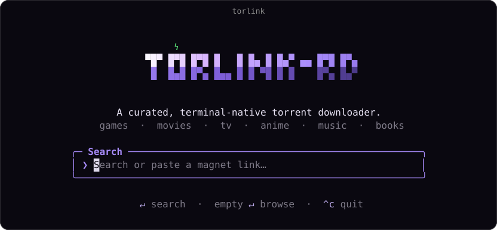
</p>

<p align="center">
  <a href="https://github.com/WarlaxZ/torlink/releases/latest"></a>
  <a href="https://www.npmjs.com/package/torlnk-rd"></a>
  <a href="https://github.com/WarlaxZ/torlink/actions/workflows/ci.yml"></a>
  <a href="https://nodejs.org"></a>
  <a href="LICENSE"></a>
</p>

<p align="center">
  <b>Find something to watch, press play, and it streams.</b><br>
  In your terminal, or in your browser, with nothing to configure.
</p>

Finding a torrent these days sucks. One site is a minefield of fake download buttons. Another hides the
real link under a popup that spawns two more tabs. And after all that, half the results are dead, zero
seeders.

torlink searches a short, hand-picked list of reputable sources all at once and hands you back the
results, sorted, with a **play** button on every one. The files are yours, saved to your downloads
folder.

<p align="center">
  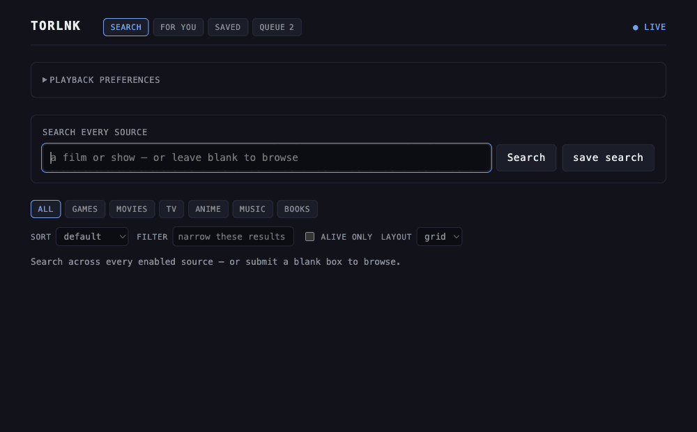
</p>

Three reasons people stick with it:

- **One keypress to watch.** Press `v` in the terminal or **play** in the browser and it starts
  streaming while it downloads — no waiting for the whole file. Set your quality bar once and
  [one-click play](#one-click-play-and-your-quality-bar) picks the release that fits and starts it.
- **Bring your own debrid, or don't.** With a [Real-Debrid or TorBox](#debrid-real-debrid-or-torbox)
  account, torrents are fetched and streamed from their servers — full speed with no seeders, and your
  IP never touches the swarm. Without one, everything still works peer-to-peer.
- **Same product on every screen.** The [browser interface](#in-your-browser) is not a cut-down port:
  same search, streaming, posters, saved lists and recommendations as the terminal. A seedbox you poke
  from your phone works as well as a laptop.

> A fork of [baairon/torlink](https://github.com/baairon/torlink), adding debrid support, the browser
> interface, one-click play, and quality-of-life touches: remembered preferences, search history, a
> source picker with an auto health-check, and a DNS-over-HTTPS escape hatch for blocked networks.

## What's in here

- **[Get started](#get-started)** — install it and run your first search
- **[What it searches](#what-it-searches)** — the source list, and why it's short
- **[The two front ends](#the-two-front-ends)** — terminal and browser, and what each is good at
- **[Watching something](#watching-something)** — streaming, one-click play, continue watching
- **[Debrid](#debrid-real-debrid-or-torbox)** — Real-Debrid or TorBox, for full speed and a private IP
- **[Downloads and seeding](#downloads-and-seeding)** — the queue, file picking, limits, giving back
- **[Recommendations](#recommendations-optional)** — a For You tab, from your own reccd server
- **[Privacy and staying safe](#privacy-and-staying-safe)** — what's exposed, and the VPN kill switch
- **[Reference](#reference)** — remote access, tokens, DNS, headless modes, containers, the three names
- **[Contributing](#contributing)** — build from source, house style

## Get started

Download a standalone executable from [Releases](https://github.com/WarlaxZ/torlink/releases), or install
the latest macOS/Linux build without Node:

```sh
curl -fsSL https://raw.githubusercontent.com/WarlaxZ/torlink/main/scripts/install.sh | sh
```

Or, with [Node 22+](https://nodejs.org), install it from npm — the command is `torlnk`:

```sh
npm install -g torlnk-rd
torlnk
```

Or run it once, without installing anything:

```sh
npx torlnk-rd
```

**On Windows**, use the executable from [Releases](https://github.com/WarlaxZ/torlink/releases) or the
npm install above — the `curl | sh` one-liner is macOS/Linux only. Everything else works the same; where
this README names a VPN interface or a network caveat, the Windows equivalent is called out.

Globally-installed copies keep themselves current: `torlnk update` pulls the latest release (and
`torlnk` quietly points it out when one is available).

That's the only thing you'll type. torlink opens straight to a search bar: search for what you want,
paste in a magnet link or a bare infohash, or just press Enter on an empty box to browse the curated
library. From there it's all keypresses, nothing to memorize, and `?` brings up the full list anytime.

<p align="center">
  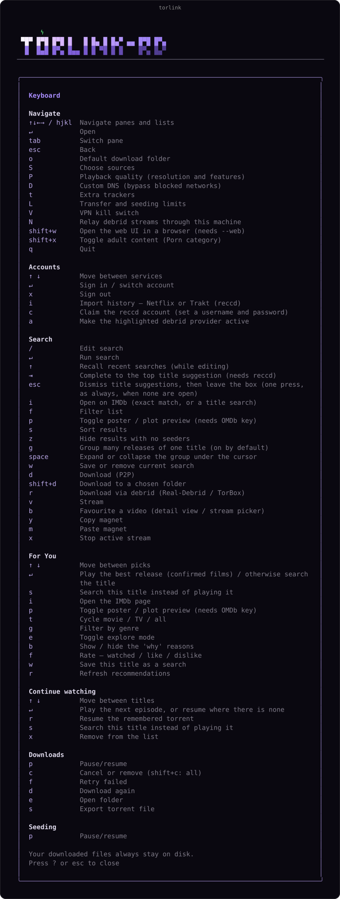
</p>

## What it searches

A short, hand-picked list of trusted sources:

| Category | Sources |
| --- | --- |
| Games | FitGirl |
| Movies | YTS, The Pirate Bay, 1337x, Torrents.csv, BitTorrented |
| TV | EZTV, The Pirate Bay, 1337x, BitTorrented |
| Anime | Nyaa, SubsPlease |
| Books | The Pirate Bay, Nyaa |
| Music | The Pirate Bay, 1337x |

**RuTracker** is available across Games, Movies, TV, Anime, Music, and Books and requires a free account.
Sign in from the **Accounts** tab in the sidebar; credentials go only to rutracker.org and only the
session cookie is stored locally. If asked for a captcha, follow the link and copy the code back.

Games are the only category that intentionally distributes executable software, so they come from
FitGirl alone, a repacker with a long, trusted track record; the other categories are media or document
files. If a source is down, the search carries on without it, and torlink tells you which one is
offline. A source that keeps failing is set aside automatically for a while so it stops slowing searches
down; you can also switch sources on and off yourself with `Shift+S`.

<p align="center">
  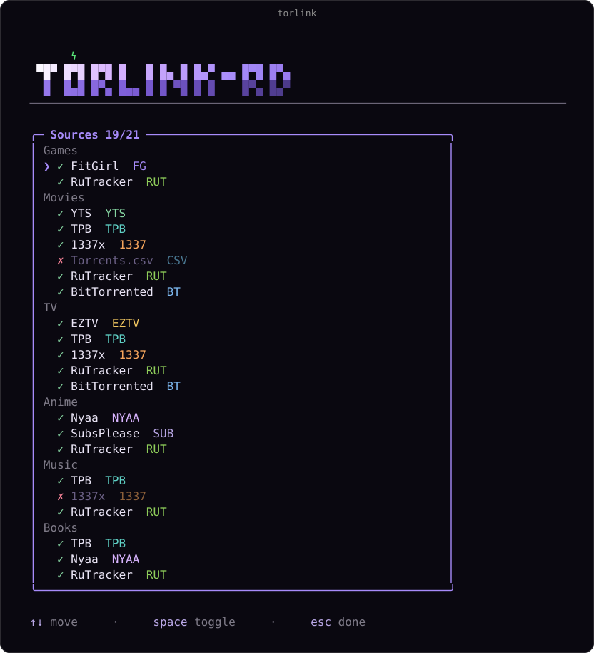
</p>

### Adult content (optional, off by default)

torlink ships with an optional **Porn** category that is **off by default** — its tab, sources, and
results stay completely hidden until you turn it on. Press **`Shift+X`** to toggle it; when enabled you
get a **Porn** tab (backed by The Pirate Bay and 1337x) and adult results also appear under **All**.

Prefer to control it without touching the app? Set `TORLINK_ADULT=1` before launching to force it on, or
`TORLINK_ADULT=0` to force it off (the env var takes precedence over the in-app setting). It can also be
persisted by setting `"adultContent": true` in your config file.

## The two front ends

Both read and write the same config, so a list you save in one shows up in the other. Use whichever
suits where you are.

### In your browser

Add `--web` and torlink also serves a browser interface — search every source (or submit an empty box to
browse the curated library, same as the TUI), posters and plots, play something, the queue, your saved
searches, library and continue watching, and your For You feed — over the same queue as the process
hosting it. Handy for a seedbox you check from your phone, or just for using torlink without a terminal
open.

```sh
torlnk --web          # the TUI hosts it; quitting the TUI stops it
torlnk serve --web    # no TUI: the add API plus the browser UI
```

The layout collapses to one column on a narrow screen, so the phone you already have in your hand is a
usable remote for a machine in the cupboard:

<p align="center">
  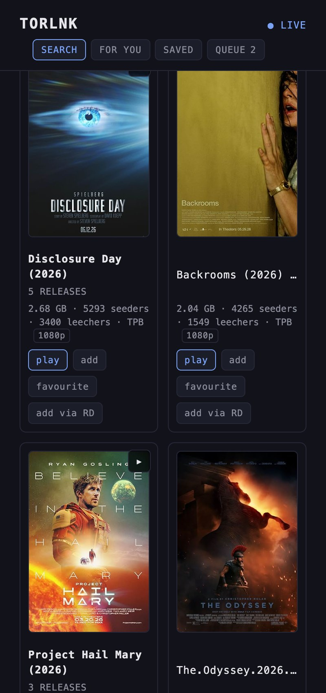
</p>

Results stream in as each source answers — you'll see `12/23 sources` climb rather than staring at a
spinner. Category tabs, sort orders and the alive-only filter are the same code the terminal uses, so the
two never disagree about what a result is or how the list is ordered.

**Many uploads of one film collapse to one row.** A browse of a single category routinely returns four
copies of everything — one live search for a popular film came back with 129 results that were 21 actual
things — so releases are grouped under their title, with a count you can expand to see every copy. Turn
it off with the **group** control. Each row also carries short quality badges (`2160p`, `HDR`, `Remux`)
read out of the release name, so you don't have to parse a 70-character filename to see what it is.
Grouping and the badges are in **both** front ends: in the terminal, **`g`** turns grouping on or off and
**space** expands the group under the cursor. The grouping key knows that an episode, a season pack and a
film are different things, so `Kepler S02E04` never merges with `Kepler S02E05` or with a `Harrowgate S03`
pack.

Selecting a result shows its poster, plot and IMDb link, if you've added a free
[OMDb](https://www.omdbapi.com/apikey.aspx) key under **Accounts** in the TUI — the same key that powers
the terminal's preview pane. Without one everything still works; you just get the release names.

That pane stays where you can see it: on a wide screen it pins below the toolbar and scrolls its own plot,
and on a phone it becomes a bar across the bottom of the window rather than something 25,000 pixels below
the list. The header, the category tabs and the sort controls are pinned too, so you can change tab or
re-sort without scrolling back to the top of a long browse. Press **`/`** to jump to the search box from
anywhere, and drive the list with the arrow keys.

From a result you can **add** it to the queue, **add via RD** or **add via TorBox** where that debrid
provider is configured, or **play** it straight away. Under TorBox, a result already on their servers
also carries a **cached** marker — Real-Debrid results never show one, for the same reason the terminal
doesn't (see [Debrid](#debrid-real-debrid-or-torbox)).

`torlnk serve --web` lands on serve's own port, **`http://127.0.0.1:9161`**, and **opens your browser
there for you**. `torlnk --web` lands on **`http://127.0.0.1:9162`** and prints the address on the
splash — it doesn't steal focus, because you asked for a terminal UI; press **shift+w** (anywhere but
the splash's search box) to open it. Change either port with `--port`. Under `serve` there's one server,
not two: the same port answers the dashboard *and* `/add`, `/downloads` and `/control`, so there's one
address to remember and one thing to firewall.

Pass `--headless` to `serve --web` if you'd rather it just printed the link. It also opens nothing under
`--daemon`, or when stdout isn't a terminal — a browser window on a machine nobody is sitting at is not
a feature.

**Turning it off is just leaving `--web` off** — there's no setting to forget about, and nothing listens
until you ask for it. If the port is already taken, the TUI says so and carries on without the dashboard
(the terminal is the product; a missing web UI shouldn't kill your session), while `serve --web` treats
it as a startup failure and exits, because a daemon that came up half-configured is worse than one that
didn't come up.

To reach it from another device, see [Remote access and tokens](#remote-access-and-tokens) — binding
anything other than loopback requires a token.

#### What the browser can't do yet

- **No restarting a stopped seed.** Stopping one drops it out of the status payload into history, which
  the browser can't see.
- **No subtitles, no scrubber.** [Continue watching](#continue-watching) does play the next episode
  automatically when a row names one — it just can't resume *where* you left off, because nothing here
  reads back from mpv, iina, vlc, or a browser tab; none of them report a position.
- **No settings page, but there is a settings control.** Tokens, sources, limits and folders are still
  TUI-only — the browser has no page for them. Playback preference is the exception: the header's
  disclosure reads and writes it directly, over the same Origin-checked API as everything else here.
  Counting that, the browser writes four things: your saved searches, your library, your
  continue-watching list (the same searches, favourites and stream history the TUI's `w`, `b`, and
  Continue-watching pane create), and that playback preference.

### In your terminal

Type what you're looking for and press Enter. Results stream in from every source as they answer, tagged
with size and how many people are sharing each one, so you can see what'll come down fast. Arrow to what
you want and press `d` to save it, or `shift+d` to pick a different folder for just that download.

Press `s` to re-sort by seeders, size, or source, and `↑` in the search box to bring back a recent
search. torlink remembers your sort and the tab you were on between runs, so it opens right where you
left off.

Many uploads of the same film collapse to one row, showing its title, year and how many copies there are —
press **space** to open one up, or **`g`** to switch grouping off entirely. Acting on a collapsed row acts
on its best copy, so `v` streams the pick you'd have chosen anyway. Rows carry short quality badges
(`2160p`, `HDR`, `Remux`) as far as the terminal's width allows, resolution first.

On a wide enough terminal a preview pane opens beside the results: highlight a film or show and torlink
fetches its poster and plot and renders them right in the terminal (bring your own free
[OMDb](https://www.omdbapi.com/apikey.aspx) key, added under Accounts). Press `p` to toggle the pane, or
`i` on any result to open its IMDb page.

Press `w` on any named search to add or remove it from your Saved searches. The pane keeps up to 50;
press `Enter` to run one again or `x` to remove it.

<p align="center">
  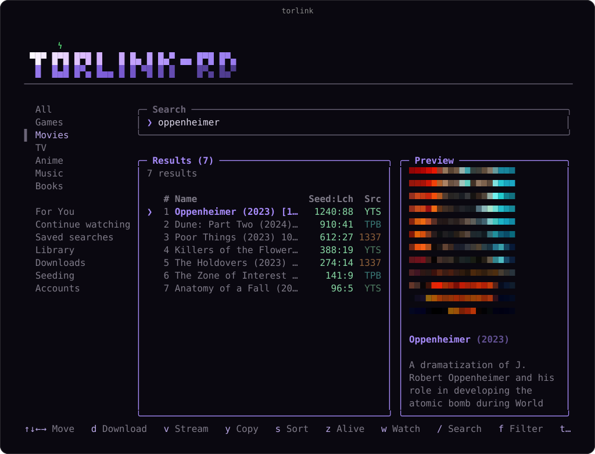
</p>

## Watching something

### Press play

Don't want to wait for a download? Press **`v`** in the terminal on a movie or an episode, or hit
**play** on any row in the browser, and torlink opens the video while it downloads.

In the terminal, the first time it'll ask which player to use (`mpv`, `iina`, `vlc`, or a path); after
that it just plays. You can set one ahead of time with `TORLINK_PLAYER`. While it plays, a banner shows
the active stream; press **`x`** to stop.

In the browser, torlnk resolves the torrent — through the active debrid provider if you have one
connected, otherwise straight from the swarm — picks the video file (or asks, if there are several), and
opens a player page. Before it builds a player at all it asks the server what the file actually *is* —
container and codecs, read with `ffprobe` where you have it and from the release name where you don't. So
what happens next is decided up front, and you find out immediately rather than watching a black rectangle
give up after twelve seconds:

- **mp4/H.264** plays inline. The video element streams it directly, and seeking works properly because
  the server honours range requests.
- **mkv, HEVC, DTS** — most of the scene — will not decode in Chrome or Firefox; no browser ships those
  codecs. Where your **debrid provider will transcode it for you**, the player uses their stream and it
  simply plays, with full seeking, and without a byte passing through the machine running torlnk.
  Real-Debrid does this. TorBox publishes no equivalent, so a TorBox stream falls through to the next line.
  Turning on [relaying](#relaying-streams-through-this-machine) switches this off on purpose: their stream
  is played from *their* servers by your browser, which is the one thing relaying exists to prevent — so
  while it's on, these releases fall through to the next line too.
- **Anything left over** — a release streamed from the swarm, or one the provider won't transcode — gets a
  card naming the part your browser can't handle, plus a **Download .m3u** button: your OS hands that tiny
  playlist to VLC (or whatever your default player is) and it plays there. On iOS and Android you also get
  a direct VLC link.

That check is also why the card is honest about *which* part is the problem. An `.mp4` that turns out to be
carrying HEVC used to look playable right up until it wasn't; now it's caught before anything loads.

<p align="center">
  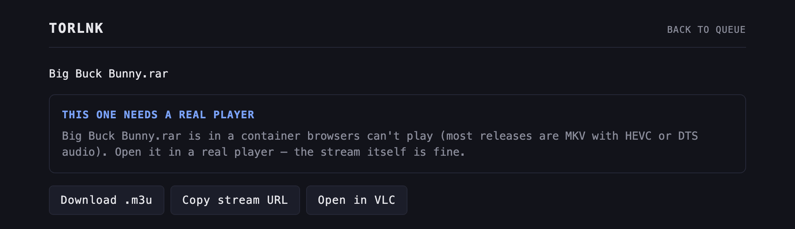
</p>

**torlnk still does no transcoding of its own.** It will not burn your CPU re-encoding a 4K remux so a
browser can play it — the transcode in that second case is the *provider's*, on their hardware and their
bandwidth, which is why it costs you nothing. Where that isn't on offer, the `.m3u` route is lossless and
works on every platform.

**Without a debrid provider**, streaming runs **peer-to-peer** through a local server — the pieces you're
watching download to a temporary folder as they play. Because that connects you straight to the swarm,
torlink warns you once that your IP is visible to peers before the first torrent stream. If the file
finished downloading by the time you stop, torlink offers to **keep** it — moving it into your downloads
folder to seed — otherwise the temporary copy is cleaned up. In the browser, the bytes are proxied from
the local torrent client, which is what makes a phone on your LAN able to play a swarm it can't reach
itself.

**With a debrid account connected**, `v` and **play** stream from that provider's servers instead:
faster, no waiting on seeders, and your IP never touches the swarm. torlink takes that route
automatically whenever an account is active, and only falls back to a torrent stream if you confirm it —
so connecting a debrid provider never quietly drops you onto peer-to-peer. By default the browser's player
redirects straight to their CDN, so the video never passes through the machine running torlnk — you get
their bandwidth and native seeking. If you'd rather the link to your account never left the server, you
can [relay it through this machine](#relaying-streams-through-this-machine) instead.

### One-click play and your quality bar

For You and [Continue watching](#continue-watching) don't always make you pick a release yourself —
pressing `↵` on a pick can search every source and play the winner outright.

What "winner" means is a preference you set once: press **`P`** in the terminal, or open **playback
preferences** in the browser's header, for a **max resolution** ceiling (absent means no ceiling) and a
require/exclude toggle over a fixed list of features — HDR, Dolby Vision, Atmos, Dolby Digital, DTS,
TrueHD, Remux, HEVC/x265, and 10-bit. The same preference and the same fixed list back both front ends,
so a cap you set in one is the cap the other honours.

<p align="center">
  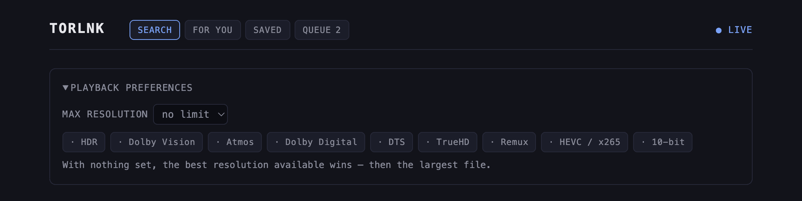
</p>

Ranking is resolution first, then, for a show, a release that names the episode you're actually watching
over a season pack, then the largest file, then the most seeders. With nothing set, that means **the best
resolution available wins, not the biggest file.**

Both the ceiling and the required features are **soft** — a preference torlink relaxes rather than a wall
it refuses to cross. If nothing fits under your resolution cap, the cap is dropped and the closest
release above it plays. If nothing matches every required feature, the rarest one is dropped first (and
the next-rarest, and so on) until something does. Either way, the status line says what gave way —
"nothing at 720p or below" or "no Atmos release" — so it never looks like the preference was silently
ignored. **Excluded features are the one hard rule**: if everything found carries something you
excluded, nothing plays.

That ranking is what one-click play uses. On a For You pick it plays a confirmed film — OMDb says it's a
movie, or the pane's type filter is explicitly films — and searches instead for anything less certain,
landing you in the search pane rather than guessing. On a Continue watching row it plays the next episode
when the row can name one, and otherwise resumes the stored torrent exactly as before, unchanged.

`s` in the terminal always searches instead of playing, for either pane. The browser's For You cards
carry the same always-**search** button alongside a **Play** button that only appears for a confirmed
film.

> **Worth knowing:** because resolution outranks the episode-versus-pack preference, watching one episode
> can fetch an entire season — a 2160p season pack beats a 720p release of just the episode you asked
> for. That's deliberate, not a bug, and `maxResolution` is the lever: cap it below the pack's resolution
> — as long as something still survives under that cap, such as the single episode itself — and the
> single episode wins instead. (A cap that excludes everything is a no-op, per the soft-ceiling behaviour
> above.)

### Continue watching

Titles you're part-way through, newest first, up to 200. Both front ends read the same list — streaming
from either one writes the same file. Each row shows the title and, when it can tell one honestly, a
suggested next episode; a season pack with no episode number in its name gets no guess, and neither does
a film.

**In the terminal**, it's a section in the sidebar:

- `Enter` plays the next episode when the row names one — a fresh search, ranked against your quality bar
  above — and otherwise replays the same torrent that worked last time. Either way it does nothing while
  another stream is still running; stop that one first.
- `x` forgets the row — except while a stream is running, when `x` stops that stream instead, so a stray
  keypress can't kill your playback and delete a row at once. The footer says which one `x` will do.

**In the browser**, it's a strip above the saved pane's two columns, with a fuller subtitle than a
terminal row has space for: how long ago you streamed it and the last episode you watched.

- **play** always replays the remembered torrent.
- **Play next**, when a next episode is known, runs a fresh search ranked against your quality bar and
  falls back to that same replay if nothing turns up.
- **search** shows you the other releases instead of resuming or auto-playing — the same escape hatch the
  For You rows have.
- **✕** removes the row.

**When a torrent holds several files**, the file picker opens on the suggested next episode rather than
the first file — which for a season pack is usually the one you just watched. That applies to any release
of a show you're part-way through, whether you played it from here, from a search, or from your library.

**There's no resume position.** torlink can't see into mpv, iina, vlc, or a browser tab, so this remembers
*what* you were watching, not *where* you got to.

## Debrid: Real-Debrid or TorBox

torlink works great on its own, but if you have a [Real-Debrid](https://real-debrid.com) or
[TorBox](https://torbox.app) account you can plug it in for a noticeably better ride. Either service
pulls the torrent onto its own servers and hands you back a plain, direct download. That means full speed
even on a torrent with no seeders, nothing waiting on a swarm to wake up, and — because the provider does
the torrenting, not you — your IP never touches the network.

To connect one, open the **Accounts** tab in the sidebar (alongside Downloads and Seeding), select
Real-Debrid or TorBox, and paste in the API token — from
[real-debrid.com/apitoken](https://real-debrid.com/apitoken) or
[torbox.app/settings](https://torbox.app/settings) respectively. torlink checks it and remembers it.
(Prefer to keep a token off disk? Set `REALDEBRID_API_TOKEN` or `TORBOX_API_TOKEN` in your environment
instead and torlink picks it up — either one overrides whatever's saved in config for that provider.)

If you connect both, torlink needs to know which one actually resolves your magnets: press **`a`** on the
highlighted provider in the Accounts tab to make it the active one. With only one token configured, that
one is used automatically; with both and no explicit choice made yet, torlink prefers Real-Debrid, so
upgrading from an earlier version that only knew about Real-Debrid doesn't change how it behaves.

<p align="center">
  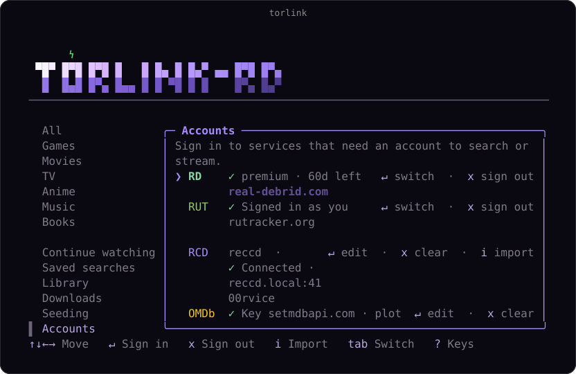
</p>

Once one's connected, downloading and streaming get an upgrade:

- **`r` — download via the active debrid provider.** torlink hands the magnet over, waits for it to be
  ready, and downloads the direct link straight to your folder. If it's already cached on the provider's
  end it's basically instant. The plain `d` download still works exactly as before, but now it warns you
  first, since that route is peer-to-peer and exposes your IP.
- **`v` — stream via the active debrid provider.** [Streaming](#press-play) routes through their servers
  instead of the swarm. If the provider can't prepare it (or your premium's lapsed), torlink tells you
  and offers a torrent stream instead rather than switching to peer-to-peer on its own.

Debrid torrents are fetched, not seeded, so they land in Recently downloaded and never join the Seeding
tab. Heads up: Real-Debrid's torrent features need an active **premium** account — torlink will tell you
if yours isn't. TorBox's free tier can add torrents too; a paid plan only raises its size limit.

TorBox results also carry a **`cached`** marker on anything it already has ready to go — a hint that the
download or stream will be instant. Real-Debrid results never show that marker, not because nothing there
is cached, but because Real-Debrid withdrew its instant-availability check in 2024 and torlink won't
guess: an absent marker means "can't tell," never "not cached."

### Relaying streams through this machine

By default the browser's player is sent straight to your provider's CDN, which is the fast, free thing to
do — but that redirect hands the player the **unrestricted link**, and that link is a bearer URL good
against your whole account, not just the one stream. Anyone who ends up with it can pull from your quota
until it expires, no token needed.

Press **`N`** in the terminal and torlink relays instead: it fetches from the provider and forwards the
bytes on, so the credential-shaped URL stops at the server and never reaches a player, a browser history,
or a chat message someone pasted a link into. **This is worth having with one user and no sharing at
all** — it's the same file, minus a credential handed out. A side effect, if you do share: every viewer
reaches the provider from this one machine rather than from their own address.

It costs something, and it lands where you might not expect — **upload**. Every byte still comes down from
the provider, but now it has to go back up from here to whoever's watching: roughly **25 Mbps up for a
1080p remux**, nearer **80 for 4K**. Three remote viewers of that 1080p remux want about **75 Mbps up**,
which is more than most domestic lines have spare. A viewer on your own LAN costs no upload at all — those
bytes never leave the network. Nothing is re-encoded, so your CPU barely notices.

It costs one convenience too: an mkv your provider would have transcoded for the browser now gets the
`.m3u` card instead, because that transcode is played from their servers and relaying is the decision not
to do that. The file still plays — in VLC, losslessly — it just isn't in the tab any more.

The browser has no switch for this, on purpose: it's a client of your config, not an editor of it, so it
picks up the change on its own like everything else here. And one thing stated plainly, with no argument
either way — sharing a debrid account is against Real-Debrid's terms, and they enforce on concurrency and
device count, not only on how many addresses a token is seen from.

## Downloads and seeding

Active downloads sit up top with their progress, speed, and time left; when one finishes it drops into
Recently downloaded just below, so the list stays tidy. Everything's still there when you come back, and
anything interrupted picks up where it left off.

Downloads run in the background while you keep searching, so you can queue up as many as you want. They
save to your downloads folder, and the Downloads pane keeps tabs on each one; press `o` anytime to change
where that is, or grab one result with `shift+d` to send it somewhere else without touching the default.
When something finishes it keeps seeding automatically so the next person can find it too, and the
Seeding tab lets you pause or stop that anytime.

When a torrent contains several files, torlink pauses before transferring payload data and lets you
choose exactly which files to download. Use `Space` to toggle files, `a` to select all, and `Enter` to
begin.

Press `Shift+L` to set download/upload limits and automatic seeding targets. Values are entered as
`download KB/s, upload KB/s, ratio, minutes`; zero or empty means unlimited. Seeding pauses when either
configured target is reached.

<p align="center">
  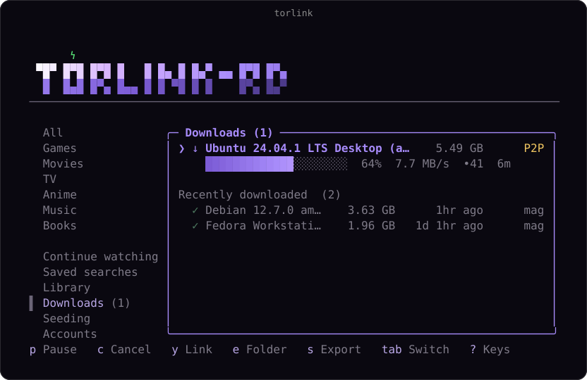
</p>

The Seeding tab shows everything you're sharing back — live upload speed and peers for each, with `p` to
pause or resume any of them.

<p align="center">
  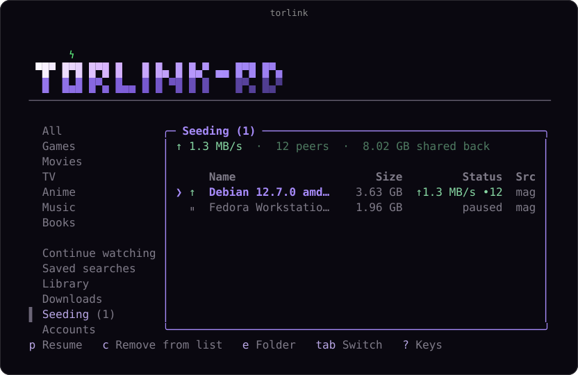
</p>

## Recommendations (optional)

If you run [reccd](https://github.com/WarlaxZ/reccd) — a small, self-hosted recommendations engine —
torlink can suggest what to watch next in a **For You** tab. Connect it from the **Accounts** tab: select
reccd, enter its URL and the bearer token from reccd's `user:add`. (Prefer to keep it off disk? Set
`TORLINK_RECC_URL` and `TORLINK_RECC_TOKEN` in your environment instead.)

The browser's **for you** tab shows the same recommendations the TUI does — poster, year, and why it
picked each one ("because you liked Harrowgate"). Rate a pick watched, liked or disliked, or **save
search** to add it to your Saved searches — the same choice the terminal's `w` makes on a For You pick,
so a pick you rate here and one you rate in the terminal land in the same place. Ratings feed back into
reccd exactly as they do from the terminal.

### Import your history

#### From Netflix

Seed reccd with what you've already watched on Netflix, so its recommendations know your taste.

1. Open [netflix.com/viewingactivity](https://www.netflix.com/viewingactivity) and click **Download all**
   (bottom of the page). You'll get a CSV.
2. Import it, either way:
   - **In the app:** open the **Accounts** tab, select **reccd** (once it's connected), press **`i`**, and
     give it the CSV path — you can drag the file onto the terminal to paste the path.
   - **From the shell:** `torlnk import-netflix ~/Downloads/NetflixViewingActivity.csv`

torlink doesn't care what you watch — titles go only to your own reccd server to seed recommendations,
and nothing else is done with them. Large exports upload in batches automatically, and re-importing the
same file won't double-count anything.

#### From Trakt

Already track your watching on [Trakt](https://trakt.tv)? Pull your watch history and ratings straight
in — no file needed.

- **In the app:** open the **Accounts** tab, select **reccd** (once it's connected), press **`i`**, and
  choose **Trakt**. You'll get a short code and a URL — open the URL, enter the code to authorize, and
  torlink imports automatically. After the first time you won't need to re-authorize.
- **From the shell:** `torlnk import-trakt` — it prints the code + URL, waits for you to authorize, then
  imports.

This needs the reccd server to have a Trakt app configured (`RECCD_TRAKT_CLIENT_ID` /
`RECCD_TRAKT_CLIENT_SECRET`); without it, torlink will tell you Trakt isn't enabled on your server.

## Privacy and staying safe

Your files stay on your disk, and nothing routes through a central server; torlink only talks to the
torrent network directly.

**What's exposed, and when.** A plain `d` download or a torrent stream is peer-to-peer, so your IP is
visible to peers — torlink warns you once before the first one, and warns again on `d` if a debrid
provider is connected. A [debrid](#debrid-real-debrid-or-torbox) download or stream never touches the
swarm, so there's nothing to expose there. The one thing a debrid stream does hand out is the link to the
file, which is a credential against your account — [relaying it](#relaying-streams-through-this-machine)
keeps that on the server.

**Seeding is on by default, and yours to switch off.** Once a download finishes it keeps seeding, sharing
it back so the next person can find it just as easily. The network only works because people pass things
along, and even a few minutes makes a real difference. If you'd rather not, opt out anytime: open the
Seeding tab, press `p` to pause or stop any item, and press it again to pick it back up. Always your
call.

**A VPN kill switch.** For a fail-closed setup, press `Shift+V` and enter the VPN interface name (`tun0`,
`utun4`, or the Windows interface alias). Before any P2P download or stream starts, torlink verifies that
the interface exists and owns the default route. It continues monitoring once per second and tears down
active P2P sessions if that route changes. Debrid transfers are unaffected, since they never touch the
swarm. This is a route kill switch, not a replacement for firewall-level VPN rules.

## Reference

### Remote access and tokens

Binding anything other than loopback **requires** a token — torlink will not leave your queue open to the
network. `serve --web` mints one for you, because it has a link to hand it to:

```sh
torlnk serve --web --host 0.0.0.0
# web ui bound to 0.0.0.0:9161 (token required)
# open on this machine:  http://127.0.0.1:9161/#k=8f3c…
# open from your LAN:    http://192.168.1.24:9161/#k=8f3c…
# api + web ui on one port, downloads -> ~/Downloads/torlink
# token 8f3c…  (pass --token to pin it across restarts)
```

The token rides in the link's `#fragment`, which never reaches the server — so it stays out of the access
log and out of any `Referer`. The page adopts it and strips it from the address bar, so a screenshot or a
shoulder-surfer doesn't get the secret; the token itself keeps working until the daemon restarts.

Only `serve --web` mints. `torlnk --web` — the TUI-hosted dashboard — still refuses a non-loopback bind
without a token, and says so on the splash rather than exiting: minting a fresh secret every time you
open your terminal UI would be a surprise, not a convenience.

A minted token is new on every start, and it's printed to stdout — which under `--daemon` is a log file,
so that file is created `0600`. Pass your own token when something else talks to the API, or when you
want a link that survives a restart:

```sh
torlnk --web --host 0.0.0.0 --token "$(openssl rand -hex 16)"
torlnk serve --web --host 0.0.0.0 --token "$(openssl rand -hex 16)"
```

Without `--web` there's no link to hand back, so `serve --host 0.0.0.0` still refuses to start without a
token: a script needs a secret it chose, not a fresh one every boot.

Both commands read the same three flags — `--host`, `--port`, `--token` — because both are one process
making one exposure decision.

> On WSL2 without mirrored networking, the LAN address printed above is your WSL VM's, and it isn't
> reachable from other machines until you add a `netsh interface portproxy` rule and a firewall opening on
> the Windows host. torlink prints the address it really bound; it can't punch through the VM's NAT for
> you.

#### Setting the token

Two ways, in the order torlink prefers them:

| | |
|---|---|
| `--token <secret>` | The flag. Works on `--web`, `serve` and `files` alike. |
| `TORLINK_API_TOKEN` | Environment. Keeps the secret out of your shell history and out of `ps`, which is what you want on a shared box. Used by `serve` and by `torlnk --web`; `files` reads `TORLINK_FILES_TOKEN`. |

The flag beats the environment variable. The environment variable is only consulted when you actually
pass `--web`, so a `TORLINK_API_TOKEN` you exported for the daemon doesn't quietly become a password on
your interactive session.

There's no token in the config file on purpose: `config.json` is world-readable in your home directory,
and a shared secret doesn't belong there.

You enter the token once in the browser, or follow a link that carries it. Either way it's kept in
`sessionStorage` and sent as an `Authorization` header on every request — no cookie authenticates the
API, so there's nothing for a hostile page to forge on your behalf. (The live-updates stream is the one
exception: browsers can't attach headers to an `EventSource`, so it passes the token in the query string,
and that route is read-only.)

On loopback with no token there is no credential at all, so requests that *change* something (`add`,
`control`, `saved-searches`, `continue-watching`, `library`) are refused when the browser says they came
from another origin — a page you happen to be visiting can't quietly tell your torlink to delete a
download, or add or remove something from your saved lists. Only positive evidence counts: `curl` and
scripts, which send no `Origin` or `Sec-Fetch-Site`, keep working exactly as before.

### From outside your network

**Don't port-forward this to the internet.** Two reasonable options:

- **[Tailscale](https://tailscale.com)** — simpler, and what I'd recommend. Bind your tailnet address and
  reach it from any of your devices with nothing exposed publicly.
- **A reverse proxy** terminating TLS in front of it, if you already run one.

The dashboard itself is fine behind a proxy — every URL it uses is relative. The one thing to watch is
the **Download .m3u** button, which has to write an absolute URL into the playlist file. It builds that
from the `Host` header, so it's correct as long as your proxy passes `Host` through (Caddy does by
default; nginx needs `proxy_set_header Host $host`). `X-Forwarded-Host` and `X-Forwarded-Proto` are
deliberately ignored — trusting them unconditionally would let any client poison the generated URL — so a
proxy that rewrites `Host` instead will produce a playlist pointing at the wrong address until a
`--trust-proxy` flag exists.

### Blocked by your network?

Some networks (ISPs, work Wi-Fi, some routers) quietly block torrent sites at the DNS level, so every
source looks offline. If that's happening, point torlink's own lookups at a public resolver over
DNS-over-HTTPS — it doesn't touch the rest of your system.

The easiest way is right in the app: press `Shift+D` and enter a resolver alias or IPs. It's saved and
applied straight away, no restart. `cloudflare`, `google`, `quad9`, and `opendns` are recognised, or pass
resolver IPs directly (e.g. `1.1.1.1,1.0.0.1`).

Prefer an environment variable? Set `TORLINK_DNS` before launching (it takes precedence over the in-app
setting):

```sh
TORLINK_DNS=cloudflare npm start
```

### Running without the TUI

torlink also runs with no terminal UI at all, for servers and seedboxes:

    torlnk watch <dir>    download anything dropped into a folder
    torlnk serve          take magnets over HTTP
    torlnk files [dir]    stream finished downloads over HTTP
    torlnk attach         keep the TUI alive across ssh sessions
    torlnk import-netflix <csv>   send a Netflix viewing-activity CSV to reccd
    torlnk import-trakt           connect Trakt and import your history into reccd

Add `--daemon` to keep watch, serve, or files running after you log out, or `--web` to `serve` for the
[browser dashboard](#in-your-browser) on the same port as the add API; `torlnk --help` has the full list
of modes and flags.

### In a container

For a seedbox, a NAS, or anywhere you'd rather not install Node, there's a `Dockerfile` and a
`docker-compose.yml` that bring up the browser interface and nothing else:

```sh
TORLINK_API_TOKEN=$(openssl rand -hex 24) docker compose up -d
```

Open `http://127.0.0.1:9162/#k=<that token>` and you're in. Compose publishes on **loopback only**, so
starting it doesn't put your library on the LAN until you change that line yourself.

Four things in there are decisions rather than defaults, and are worth knowing before you tune it:

- **Set the token.** torlink would boot without one — given `--web` it mints a token and prints the link
  to its log rather than refusing. But a minted token is new on every restart, so with
  `restart: unless-stopped` your bookmark breaks the first time the container bounces.
- **One volume, `/state`.** `TORLINK_STATE_DIR` puts config, data and cache under a single directory, so
  that one mount holds your tokens, the queue, watch history, seeds and the poster cache. Downloads land
  in `/state/Downloads/torlink` — repoint that mount at a bigger disk and the files follow.
- **`ffmpeg` is in the image.** It's what lets the player [know a release's real codecs](#press-play) up
  front instead of guessing from its name. It stays optional in the code — torlink runs fine without it —
  but a container is a controlled environment, so there's no reason to ship one without.
- **Debian, not Alpine.** The WebRTC module ships prebuilt binaries for glibc and not musl, and its
  install is deliberately fail-soft, so an Alpine image would hand you a *working* torlink that had
  quietly lost WebRTC peers. The cost is size: about 700 MB, most of it ffmpeg's codec libraries.

No BitTorrent port is published. Outbound peers connect fine, so the swarm works — but nothing can dial
in, so seeding ratios suffer. Publish the port you've configured if that matters to you.

### Posters

Posters are fetched once and cached on disk. The browser gets the full-quality image; the TUI
half-blocks that same cached file, so turning the web UI on makes terminal browsing slightly faster too.
The cache is capped, pruned oldest-first, and safe to delete at any time.

Poster fetches are restricted to a small allowlist of known image CDNs, re-checked on every redirect
hop — a refusal is logged at `warn` level.

### The three names

The project is **torlink** — and so is your config directory and every `TORLINK_*` variable — but the
command is `torlnk` and the npm package is `torlnk-rd`. Plain `torlnk` on npm is the upstream project
this forked from, and npm rejects `torlink` as too similar to it, so the short spellings are the ones
that were actually available.

## Contributing

To run or work on torlink locally, with [Node 22+](https://nodejs.org):

1. Clone the repository and open the folder.
2. Install dependencies:
   ```sh
   npm install
   ```
3. Run the development version:
   ```sh
   npm run dev
   ```
   Or build it and run the bundled version:
   ```sh
   npm run build
   npm start
   ```

**Working on the web UI:** the dashboard is served from `dist/web`, **not** `src`. Edit anything under
`src/web/static/`, reload, and you'll get silently stale assets — it reads exactly like a browser cache
bug, so it's easy to lose twenty minutes in devtools before suspecting the build. Rerun `npm run build`
after any change there. `npm run dev` only re-executes the server's TypeScript; it does not rebuild the
browser bundle.

Before opening a PR, skim [CONTRIBUTING.md](CONTRIBUTING.md); it lays out the bar with examples from real
merged PRs.

## Star History

<a href="https://www.star-history.com/?repos=WarlaxZ%2Ftorlink&type=date&legend=top-left">
 <picture>
   <source media="(prefers-color-scheme: dark)" srcset="https://api.star-history.com/chart?repos=WarlaxZ/torlink&type=date&theme=dark&legend=top-left&sealed_token=Yg4hUUad3yejtB59ol_9oa_txdk4yd_bnxalz7CMThT9SC9a-Wp0KGwr9kC5xkEDdh8NmVay3FEDNWRn7rzyua2XNIWZbPlRBKVhZBceS-_c0I17OmC4iPLdpvYczXgUs25ywnA4Xc2llpJ6bOcfu8y91CtmGj9qVOjlyMRsIzkGkABQvYWO2whetowq" />
   <source media="(prefers-color-scheme: light)" srcset="https://api.star-history.com/chart?repos=WarlaxZ/torlink&type=date&legend=top-left&sealed_token=Yg4hUUad3yejtB59ol_9oa_txdk4yd_bnxalz7CMThT9SC9a-Wp0KGwr9kC5xkEDdh8NmVay3FEDNWRn7rzyua2XNIWZbPlRBKVhZBceS-_c0I17OmC4iPLdpvYczXgUs25ywnA4Xc2llpJ6bOcfu8y91CtmGj9qVOjlyMRsIzkGkABQvYWO2whetowq" />
   
 </picture>
</a>
